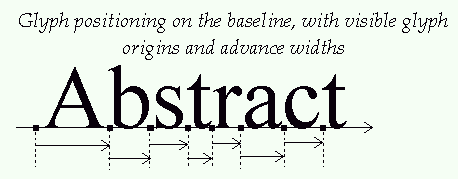
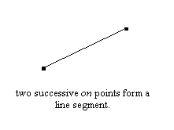
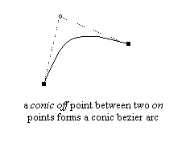
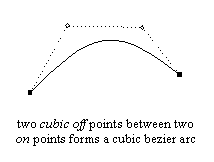
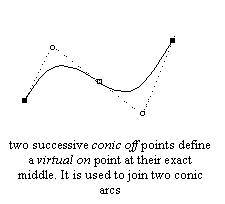
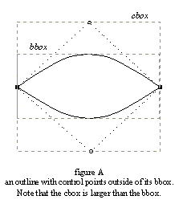
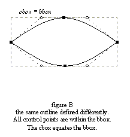
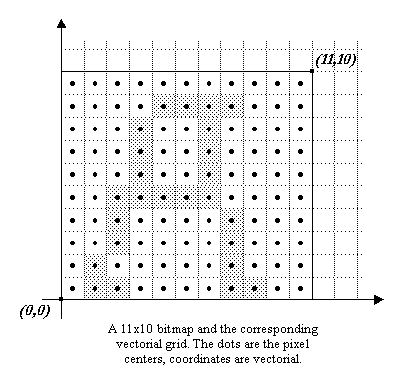
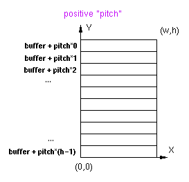

% Freetype 中文手册
% Cathy.zheng(原稿) Linky.chen(校对补充)
% 英文地址: https://www.freetype.org/freetype2/docs/documentation.html

# FreeType 字形约定
## 基本印刷概念 (Basic Typographic Concepts)
### 字体文件、格式和信息(Font files, format and information)
字体是一组可以被显示和打印的多样的字符映像，在单个字体中共享一些共有的特性，包括外表、风格、衬线等。按印刷领域的说法，它必须区别一个字体家族和多种字体外观，后者通常是从同样的模板而来，但是风格不同。例如，Palatino Regular 和 Palatino Italic 是两种不同的外观，但是属于同样的家族 Palatino。

单个字体术语根据上下文既可以指家族也可指外观。例如，大多文字处理器的用户用字体指不同的字体家族，然而，大多这些家族根据它们的格式会通过多个数据文件实现。对于 TrueType 来讲，通常是每个外观一个文件（arial.ttf 对应 Arial Regular 外观，ariali.ttf 对应 Arial Italic 外观）这个文件也叫字体，但是实际上只是一个字体外观。

数字字体是一个可以包含一个和多个字体外观的数据文件，它们每个都包含字符映像、字符度量，以及
其他各种有关文本布局和特定字符编码的重要信息。对有些难用的格式，像 Adobe 的 Type1，一个字体外观
由几个文件描述（一个包含字符映象，一个包含字符度量等）。在这里我们忽略这种情况，只考虑一个外观
一个文件的情况，不过在 FT2.0 中，能够处理多文件字体。

为了方便说明，一个包含多个外观的字体文件我们叫做字体集合，这种情况不多见，但是多数亚洲字体都是如此，它们会包含两种或多种表现形式的映像，例如横向和纵向布局。

### 字符映象和图(Character images and mappings)
字符映象叫做字形，根据书写、用法和上下文，单个字符能够有多个不同的映象，即多个字形。多个字符也可以有一个字形（例如 Roman）。字符和字形之间的关系可能是非常复杂，本文不多述。而且，多数字体格式都使用不太难用的方案存储和访问字形。为了清晰的原因，当说明 FT 时，保持下面的观念

* 一个字体文件包含一组字形，每个字形可以存成位图、向量表示或其他结构（更可缩放的格式使用一种数学表示和控制数据/程序的结合方式）。这些字形可以以任意顺序存在字体文件中，通常通过一个简单的字形索引访问。
* 字体文件包含一个或多个表，称为 字符映射（简称为“charmaps”或“cmaps”），用来为某种字符编码将字符码转换成字形索引，例如 ASCII、Unicode、Big5 等等。单个字体文件可能包含多个字符图，例如大多 TrueType 字体文件都会包含一个 Apple特定的字符图和 Unicode 字符图，使它在 Mac 和 Windows 平台都可以使用。

### 字符和字体度量(Character and font metrics)
每个字符映象都关联多种度量，被用来在渲染文本时，描述如何放置和管理它们。在后面会有详述，它们和字形位置、光标步进和文本布局有关。它们在渲染一个文本串时计算文本流时非常重要。

每个可缩放的字体格式也包含一些全局的度量，用概念单位表示，描述同一种外观的所有字形的一些特性，例如最大字形外框，字体的上行字符、下行字符和文本高度等。

虽然这些度量也会存在于一些不可缩放格式，但它们只应用于一组指定字符维度和分辨率，并且通常用象素表示。

## 字形轮廓(Glyph Outlines)
本节描述了FreeType以及客户端应用程序使用称为轮廓的字形图像的可缩放表示方式。

### 象素、点和设备解析度(Pixels, points, and device resolutions)
当处理计算机图形程序时，指定象素的物理尺寸不是正方的。通常，输出设备是屏幕或打印机，在水平和垂直方向都有多种分辨率，当渲染文本是要注意这些情况。

定义设备的分辨率通常使用用 dpi（每英寸点(dot)数）表示的两个数，例如，一个打印机的分辨率为300x600dpi 表示在水平方向，每英寸有 300 个象素，在垂直方向有 600 个象素。一个典型的计算机显示器根据它的大小，分辨率不同（15’’和 17’’显示器对 640x480 象素大小不同），当然图形模式分辨率也不一样。

所以，文本的大小通常用点（point）表示，而不是用设备特定的象素。点是一种简单的物理单位，在数字印刷中，一点等于 1/72 英寸。例如，大多罗马书籍使用 10 到 14 点大小印刷文字内容。

可以用点数大小来计算象素数，公式如下：

|	象素数 = 点数*分辨率/72
	pixel_size = point_size * resolution / 72

分辨率用 dpi 表示，因为水平和垂直分辨率可以不同，单个点数通常定义不同象素文本宽度和高度。

### 矢量表示(Vectorial representation)

字体轮廓的源格式是一组封闭的路径，叫做轮廓线。每个轮廓线划定字形的外部或内部区域，它们可以是线段或是 Bezier 曲线。

曲线通过控制点定义，根据字体格式，可以是二次(conic Beziers)或三次(cubic Beziers)多项式。在文献中，
conic Bezier 通常称为 quadratic Beziers。因此，轮廓中每个点都有一个标志表示它的类型是一般还是控制点，
缩放这些点将缩放整个轮廓。

每个字形最初的轮廓点放置在一个不可分割单元的网格中，点通常在字体文件中以 16 位整型网格坐标存储，网格的原点在(0,0)，它的范围是-16384 到-16383（虽然有的格式如 Type1 使用浮点型，但为简便起见，
我们约定用整型分析）。

网格的方向和传统数学二维平面一致，x 轴从左到右，y 轴从下到上。

在创建字形轮廓时，一个字体设计者使用一个假想的正方形，叫做 EM 正方形。他可以想象成一个画字符的平面。正方形的大小，即它边长的网格单元是很重要的，原因是 ：

* 它是用来将轮廓缩放到指定文本尺寸的参考，例如在 300x300dpi 中的 12pt 大小对应 12*300/72=50 象素。从网格单元缩放到象素可以使用下面的公式

|	象素数 ＝ 点数 × 分辨率/72 
	(pixel_size = point_size * resolution / 72)
|	象素坐标＝ 网格坐标*象素数/EM 大小 
	(pixel_coord = grid_coord * pixel_size / EM_size)

* EM 尺寸越大，可以达到更大的分辨率，例如一个极端的例子，一个 4 单元的 EM，只有 25 个点位置，
显然不够，通常 TrueType 字体只用 2048 单元的 EM；Type1 PostScript 字体有一个固定 1000 网格单元的EM，但是点坐标可以用浮点值表示。

注意，字形可以自由扩展到 EM 正方形，因此，EM广场只是传统印刷术的惯例。网格单元通常称为字体单元或 EM 单元。

上边的象素数并不是指
实际字符的大小，而是 EM 正方形显示的大小，所以不同字体，虽然同样大小，但是它们的高度可能不同。
这就解释了为什么以下文字的字母不一样的高度，尽管它们以不同的字体显示在相同的点大小上：

{#id .class width=80%}

可以看出，Courier家族的字形小于Times New Roman的字形，它们本身略小于Arial的字形，即使一切都以16点的大小显示或打印。这只反映了设计选择。

### Hinting 和位图渲染 (Hinting and Bitmap rendering)
存储在一个字体文件中的轮廓叫“主”轮廓，它的点坐标用字体单元表示，在它被转换成一个位图时，
它必须缩放至指定大小。这通过一个简单的转换完成，但是总会产生一些不想要的副作用，例如像字母 E 和H，它们主干的宽度和高度会不相同。

所以，优秀的字形渲染过程在缩放“点”是，需要通过一个网格对齐(grid-fitting)的操作（通常叫 hinting），
将它们对齐到目标设备的象素网格。这主要目的之一是为了确保整个字体中，重要的宽度和高度能够一致。
例如对于字符 I 和 T 来说，它们那个垂直笔划要保持同样象素宽度。另外，它的目的还有管理如 stem 和overshoot 的特性，这在小象素字体会引起一些问题。

有若干种方式来处理网格对齐，多数可缩放格式中，每种字形轮廓都有一些控制数据和程序。

* **显式网格对齐(explicit grid-fitting)**

	TrueType 格式定义了一个基于栈的虚拟机（VM），可以借助多于 200 中操作码（大多是几何操作）来编写程序，每个字形都由一个轮廓和一个控制程序组成，后者可以处理实际的网格对齐，他由字体设计者定义。

* **隐式网格对齐（implicit grid-fitting also called hinting）**

	Type1 格式有一个更简单的方式，每个字形由一个轮廓以及若干叫 hints 的片断组成，后者用来描述字形的某些重要特性，例如主干的存在、某些宽度匀称性等诸如此类。没有多少种 hint，要看渲染器如何解释 hint
来产生一个对齐的轮廓。

* **自动网格对齐(automatic grid-fitting)**

	有些格式很简单，没有包括控制信息，将字体度量如步进、宽度和高度分开。要靠渲染器来猜测轮廓的一些特性来实现得体的网格对齐。

+-------------+--------------------------------------+------------------------------------------+
| 网格对齐    |                     优点             |     缺点                                 |
+=============+======================================+==========================================+
| 显式对齐    | - 质量: 小尺寸的优异效果是可能的。   |  - 速度: 如果字形程序复杂，		|
|             | 这对于屏幕显示非常重要。             |  解释字节码可能很慢。			|
|             | - 一致性: 所有渲染器都产生相同的     |  - 尺寸: 字形程序可以很长。		|
|             | 字形位图（至少在理论上）。           |  - 技术难度: 写出好的方案是非常困难的。	|
|             |                                      |  很少的工具可用。			|
+-------------+--------------------------------------+------------------------------------------+
| 隐式对齐    | - 尺寸: 通常比显式字形程序小得多     |  - 质量: 小字体存在问题。虽然反锯齿比较好。|
|             | - 速度: 网格化通常是一个快速的       |  - 不一致性: 不同渲染器结果不同，甚至同一引擎不同版本也不同|
|             | 过程。                               |						|
+-------------+--------------------------------------+------------------------------------------+
| 自动对齐    | - 尺寸: 不需要控制信息，导致较       | - 质量: 小字体存在问题。虽然反锯齿比较好。|
|             | 小的字体文件。                       | - 速度: 取决于网格对齐算法。		|
|             |  - 速度: 取决于网格拟合算法。        | - 不一致性: 结果可以在不同的渲染器之间变化|
|             |  通常比显示的网格对齐快。            |  或者甚至是相同引擎的不同版本。   	|
+-------------+--------------------------------------+------------------------------------------+
 

## 字形度量 (Glyph Metrics)
### 基线(baseline)、笔(pen)和布局(layout)
基线是一个假想的线，用来在渲染文本时知道字形，它可以是水平（如 Roman）和是垂直的（如中文）。
而且，为了渲染文本，在基线上有一个虚拟的点，叫做笔位置（pen position）或原点（origin）
，他用来定位字形。

每种布局使用不同的规约来放置字形：

* 对水平布局，字形简单地搁在基线上，通过增加笔位置来渲染文本，既可以向右也可以向左增加。 两个相邻笔位置之间的距离是根据字形不同的，叫做步进宽度（advance width）。注意这个值总是正数，即使是从右往左的方向排列字符，如 Arabic。这和文本渲染的方式有些不同。
笔位置总是放置在基线上。如图:[水平布局]

{width=458px height=179px}

* 对垂直布局，字形在基线上居中放置。如图[垂直布局]：

{width=162px height=275px}

### 印刷度量和边界框(Typographic metrics and bounding boxes)
在指定字体中，定义了多种外观度量。

* 上行高度（Ascent）。从基线到放置轮廓点最高/上的网格坐标，因为 Y 轴方向是向上的，所以它是一个正值。
* 下行高度（Descent）。从基线到放置轮廓点最低/下的网格坐标，因为 Y 轴方向是向上的，所以它是一个负值。
* 行距（Linegap）。两行文本间必须的距离，基线到基线的距离应该计算成：

linespace = ascent - descent + linegap

如果您使用印刷值。

其他更简单的指标是：

* 边界框（bounding box，bbox）。这是一个假想的框子，他尽可能紧密的装入字形。通过四个值来表示，

叫做 xMin、yMin、xMax、yMax，对任何轮廓都可以计算，它们可以是字体单元（测量原始轮廓）或者
整型象素单元（测量已缩放的轮廓）。注意，如果不是为了网格对齐，你无需知道这个框子的这个值，只需知道它的大小即可。但为了正确渲染一个对齐的字形，需要保存每个字形在基线上转换、放置的重要对齐。

* 内部 leading(internal leading)。

这个概念从传统印刷业而来，他表示字形出了 EM 正方形空间数量，通常计算如下：

internal leading = ascent – descent – EM_size

* 外部 leading(External leading)。

行距的别名。

### 跨距和步进 (Bearings and Advances)
每个字形都有叫跨距和步进的距离，它们的定义是常量，但是它们的值依赖布局，同样的字形可以用来
渲染横向或纵向文字。

* 左跨距(Left side bearing)或 bearingX。从当前笔位置到字形左 bbox 边界的水平距离，对水平布局是正数，对垂直布局大多是负值。
在FreeType API中，这也被称为 bearingX。另一个简写是“lsb”。
* 上跨距(Top side bearing)或 bearingY。从基线到 bbox 上边界的垂直距离，对水平布局是正值，对垂直布局是负值。
在FreeType API中，这也被称为 bearingY。
* 步进宽度(Advance width)或 advanceX。当处理文本渲染一个字形后，笔位置必须增加（从左向右）或减少（从右向左）
的水平距离。对水平布局总是正值，垂直布局为 null。
在FreeType API中，这也被称为 advanceX。
* 步进高度(Advance height)或 advanceY。当每个字形渲染后，笔位置必须减少的垂直距离。对水平布局为 null，对垂直布局总是正值。
在FreeType API中，这也被称为 advanceY。
* 字形宽度(Glyph width)。字形的水平长度。对未缩放的字体坐标，它是 bbox.xMax-bbox.xMin，对已缩放字形，它的计算要看特定情况，视乎不同的网格对齐而定。

glyph width = bbox.xMax - bbox.xMin

* 字形高度(Glyph height)。字形的垂直长度。对未缩放的字体坐标，它是 bbox.yMax-bbox.yMin，对已缩放字形，它的计算要看特定情况，视乎不同的网格对齐而定。
在FreeType API中，这也被称为 advanceX。
* 右跨距(Right side bearing)。只用于水平布局，描述从 bbox 右边到步进宽度的距离，通常是一个非负值。

advance_width – left_side_bearing – (xMax-xMin)

该值的常见简写是“rsb”。

图[horizental_metrics]是水平布局所有的Metrics

{width=388px height=253px}

图[vertival_metrics]是垂直布局的Metrics：

{width=294px height=278px}

### 网格对齐的效果(The effects of grid-fitting)
因为 hinting 将字形的控制点对齐到象素网格，这个过程将稍稍修改字符映象的尺寸，和简单的缩放有所区别。例如，小写字母 m 的映象在主网格中有时是一个正方形，但是为了使它在小象素大小情况下可以辨别，
hinting 试图扩大它已缩放轮廓，以让它三条腿区分开来，这将导致一个更大的字符位图。
字形度量也会受网格对齐过程的影响：

* 映象的宽度和高度改变了，即使只是一个象素，对于小象素大小字形区别都很大；
* 映象的边界框改变了，也改变了跨距；
* 步进必须更改，例如如果被 hint 的位图比缩放的位图大时，必须增加步进宽度，来反映扩大的字形宽度。

这有一些影响，

* 因为 hinting，简单缩放字体上行或下行高度可能不会有正确的结果，一个可能的方法时保持被缩放上行高度的顶和被缩放下行高度的底。
* 没有容易的方法去 hint 一个范围内字形并步进它们宽度，因为 hinting 对每个轮廓工作都不一样。唯一的方法时单独 hint 每个字形，并记录返回值。有些格式，如 TrueType，包含一些表对一些通用字符预先计算出它们的象素大小。
* hinting 依赖最终字符宽度和高度的象素值，意味着它非常依赖分辨率，这个特性使得正确的所见即所得布局非常难以实现。

在 FT 中，对字形轮廓处理 2D 变换很简单，但是对一个已 hint 的轮廓，需要注意**专门使用整型象素
距离**（意味着 FT_Outline_Translate() 函数的参数应该都乘以 64，因为点坐标都是 26.6 固定浮点格式），否则，
变换将破坏 hinter 的工作，导致非常难看的位图。

但是请注意，上一段所述的对整数像素距离的限制已经变弱; 今天，它是很常见的做任何 暗示沿水平轴，仅调整字形垂直。典型的例子是Microsoft的ClearType实现，FreeType的新CFF引擎（由Adobe提供）或“轻”自动提示模式。对于这样的模式，如果您进行子像素字形定位，您将获得最佳渲染结果。

### 文本宽度和边界框( Text widths and bounding box)
如上所示，指定字形的原点对应基线上笔的位置，没有必要定位字形边界框的某个角，这不像多数典型的位图字体格式。有些情况，原点可以在边界框的外边，有时，也可以在里边，这要看给定的字形外形了。
同样，字形的步进宽度是在布局时应用于笔位置的增量，而不是字形的宽度，那是字形边界的宽度。对文本串，具有相同的规约，这意味着：

* 指定文本串的边界框没有必要包含文本光标，也不需要后边的字形放置在它的角上。
* 字符串的步进宽度和它的边界框大小无关，特别时它在开始和最后包含空格或 tab。
* 最后，附加的处理如间距调整能够创建文本串，它的大小不直接依赖单独字形度量并列排列。例如，VA
的步进宽度不是 V 和 A 各自的步进之和。

## 字距调整(Kerning)
术语字距调整是指用于调整文本串中连续字形的相对位置的特定信息。本节介绍几种类型的字距信息，以及在执行文本布局时处理它们的方式。

### 字距调整对(Kerning pairs)
字距调整(Kerning)包括根据相邻字形的轮廓修改它们之间的距离。例如 T 和 y 可以贴得更近一点，因为 y 的上缘正好在 T 的右上角一横的下边。
当仅仅根据字形的标准宽度来布局文本，一些连续的字符看上去有点太挤和太松，有的字体外观包含一个表，它包含文本布局所需的指定字形对的字距距离。
例如，在单词"BRAVO"之间的'A'和'V'之间的空间似乎比需要的要宽一些。如图:[字距未调整]

将此与相同的词语进行比较，这两个字母之间的距离略有减少。如图:[字距调整]

正如你所看到的，这种调整可以产生很大的影响。因此，一些字体面包括包含用于文本布局的一组给定字形对的字距距离的表。

* 这个对是顺序的，AV 对的距离和 VA 对不一定一致,他们还使用字形索引，而不是字符代码。
* 依据布局或脚本，字距可以表示水平或垂直方向。例如，像阿拉伯语这样的水平布局可以使用连续字形之间的垂直字距调整。垂直脚本可以具有垂直的字距距离。
* 字距表示成网格单元，它们通常是 X 轴方向的，意味着负值表示两个字形需要在水平方向放的更近一点。

请注意，OpenType字体（OTF）分别使用作为OTF文件一部分的“kern”和“GPOS”表提供了两种不同的字距调整机制。较旧的字体仅包含前者，而最近的字体仅包含表格或甚至包含“GPOS”数据。FreeType仅通过（相当简单的）'kern'表支持字距调整。为了解释（高度复杂的）GPOS表格中的字距数据，您需要像**ICU**或 **HarfBuzz** 这样的更高级别的库，因为它可以是上下文相关的（这是，例如字距调整可能因文本字符串中的位置而异）。

### 应用字距调整(Applying kerning)
在渲染文本时应用字据调整是一个比较简单的过程，只需要在写下一个字形时，将缩放的字距加到笔位置即可。然而，正确的渲染器要考虑的更细一点。
“滑点”问题是一个很好的例子：很多字体外观包括一个大写字符（如 'T'、'F'）和后面的点（'.'）之间的字距调整，以将点正好放置在前者的主腿的右侧。

这有时需要在其后面的点和字母之间进行额外的调整，这取决于封闭字母的形状。当应用“标准”字距调整时，上一句将成为

这显然太紧缩了(原文:This is clearly too contracted)．如第一个示例所示，这里的解决方案是仅在条件适合的情况下滑动点。当然，这需要对文本含义有一定的了解，这正是GPOS的擅长的：根据上下文，不同的字距值能够被应用到获取正确的印刷排版结果。

有一个很简单地算法，可以避免滑点问题。(注意:该段原文没有)

* 在基线上放置第一个字形；
* 将笔位置保存到 pen1；
* 根据第一个和第二个字形的字距距离调整笔位置；
* 放置第二个字形，并计算下个笔位置，放到 pen2；
* 如果 pen1 大于 pen2，使用 pen1 作为下个笔位置，否则使用 pen2。

## 文本处理(Text Processing)
本部分演示了使用以前定义的概念来呈现文本的算法，无论您使用何种布局。它假设简单的文本处理适用于拉丁语或西里尔字体等脚本，使用输入字符代码和输出字形索引之间的一对一关系。像阿拉伯语或高棉语这样的脚本，需要一个“整形引擎”才能将字符代码转换为字形索引转换，这超出了范围（应该由像Pango这样的适当布局引擎来完成 ）。

### 书写简单文本串(Writing simple text strings)
在第一个例子中，我们将生成一个简单的 Roman 文字串，即采用水平的自左向右布局，使用专有的象素度量，
这个过程如下：

* 将字符串转换成一系列字形索引；
* 将笔放置在光标位置；
* 获得或装入字形映象；
* 平移字形以使它的原点匹配笔位置；
* 将字形渲染到目标设备；
* 根据字形的步进象素增加笔位置；
* 对剩余的字形进行第三步；
* 当所有字形都处理了，在新的笔位置设置文本光标。
注意字距调整不在这个算法中。

### 子象素定位(Subpixel positioning)
在渲染文本时使用子象素定位有时很有用。这非常重要，例如为了提供半所见即所得的文本布局，文本渲染的算法和上一节很相似，但是有些区别：

* 笔位置表示成小数形式的象素；
* 隐式的轮廓必须水平移动到正确的子像素位置。
* 步进宽度表示成小数形式的象素，没有必要是整型。

这里是算法的改进版本：

* 将字符串转换成一系列字形索引；
* 将笔放置在光标位置，这可以是一个非整型点；
* 获得或装入字形映象；
* 平移字形以使它的原点匹配取整后的笔位置；用'pen_pos - floor（pen_pos）'翻译字形。
* 将字形渲染到目标设备；在“floor（pen_pos）”上将目标设备的字形渲染。
* 根据字形的步进象素宽度增加笔位置，这个宽度可以是小数形式；
* 对剩余的字形进行第三步；
* 当所有字形都处理了，在新的笔位置设置文本光标。
注意使用小数象素定位后，两个指定字符间的空间将不是固定的，它右先前的取整操作堆积的数决定。

### 简单字距调整(Simple kerning)
在基本文本渲染算法上增加字距调整非常简单，当一个字距调整对发现了，简单地在第 4 步前，将缩放后的
调整距离增加到笔位置即可。淡然，这个距离在算法 1 需要被取整，算法 2 不必要。
这给了我们：

算法1字距调整：

* 将字符串转换为一系列字形索引。
* 将笔放在光标位置。
* 获取或加载字形图像。
* 将圆形缩放的字距距离（如果有的话）添加到笔位置。
* 翻译字形，使其“起点”与笔的位置相匹配。
* 将字形渲染到目标设备。
* 通过字形的前进宽度（以像素为单位）增加笔位置。
* 对于每个剩余的字形，从第3步开始。

具有字距调整的算法2：

* 将字符串转换为一系列字形索引。
* 将笔放在光标位置。
* 获取或加载字形图像。
* 将缩放的未包围的字距距离（如果有的话）添加到笔位置。
* 用'pen_pos - int（pen_pos）'翻译字形。
* 以'int（pen_pos）'的形式将目标设备渲染为目标设备。
* 以小数像素增加笔迹的前进宽度。
* 对于每个剩余的字形，从第3步开始。

### 自右向左布局(Right-to-left layout)
布局从右到左的脚本（现代）希伯来语文本的过程非常相似。唯一的区别是，在字形渲染之前，笔位必须递减（记住：提前宽度总是为正，即使是希伯来字形）。

从右到左算法1：

* 将字符串转换为一系列字形索引。
* 将笔放在光标位置。
* 获取或加载字形图像。
* 通过字形的前进宽度（以像素为单位）减少笔位置。
* 翻译字形，使其“起点”与笔的位置相匹配。
* 将字形渲染到目标设备。
* 对于每个剩余的字形，从第3步开始。

对算法2的改变以及包含字距调整作为读者的练习。

### 垂直布局(Vertical layouts)
布局垂直文字也是同样的过程，重要的区别如下：

* 基线是垂直的，使用垂直的度量而不是水平度量；
* 左跨距通常是负的，但字形原点必须在基线上；
* 步进高度总是正值，所以笔位置必须减少以从上至下书写,（假设Y  轴向上），笔位置必须递减。

这里算法：

* 将字符串转换为一系列字形索引。
* 将笔放在光标位置。
* 获取或加载字形图像。
* 翻译字形，使其“起点”与笔的位置相匹配。
* 将字形渲染到目标设备。
* 以像素为单位减少垂直笔位置的字形提前高度。
* 对于每个剩余的字形，从第3步开始。
* 当所有字形完成后，将文本光标设置到新的笔位置。

## 字体轮廓(FreeType outlines)
本节的目的是介绍FreeType管理向量轮廓的方式，以及可以应用于它们的最常见的操作。

### FT 轮廓描述和结构(FreeType outline description and structure)

#### 轮廓曲线分解(Outline curve decomposition)

一个轮廓是 2D 平面上一系列封闭的轮廓线。每个轮廓线由一系列线段和 Bézier 弧组成，根据文件格式不同，
曲线可以是二次和三次多项式，前者叫 quadratic 或 conic 弧(二次曲线或圆锥曲线)，它们在 TrueType 格式中用到，后者叫 cubic 弧，多数用于 Type1、CFF、CFF2 格式。

每条弧由一系列起点、终点和控制点描述，轮廓的每个点有一个特定的标记，表示它用来描述一个线段还是一条弧。这个标记可以有以下值：

FT_Curve_Tag_On 当点在曲线上，这对应线段和弧的起点和终点。其他标记叫做“Off”点，即它不在轮廓线上，但是作为 Bezier 弧的控制点。

FT_Curve_Tag_Conic 一个 Off 点，控制一个 conic Bezier 弧

FT_Curve_Tag_Cubic 一个 Off 点，控制一个 cubic Bezier 弧

使用FT_CURVE_TAG(tag)宏来过滤掉其他内部使用的标志。

下面的规则应用于将轮廓点分解成线段和弧

* 两个相邻的“on”点表示一条线段；
* 一个 conic Off 点在两个 on 点之间表示一个 conic Bezier 弧，off 点是控制点，on 点是起点和终点；
* 两个相邻的 cubic off 点在两个 on 点之间表示一个 cubic Bézier 弧，它必须有两个 cubic 控制点和两个 on 点。
* 最后，两个相邻的 conic off 点强制光栅化器（在扫描线转换过程中）仅在其正中间创建一个虚拟的“on”点。这大大方便了连续conic Bézier弧的定义。此外，它是TrueType规范中描述的方式。
* 轮廓中的最后一点使用第一个作为终点来创建封闭轮廓。例如，如果一个轮廓的最后两个点是一个“on”点，然后是一个圆锥“off”点，轮廓中的第一个点将被用作最终点，以创建一个“on” - “off” - “on"序列。
* 轮廓上的第一个点可以是一个圆锥断点本身; 在这种情况下，使用轮廓的最后一个点作为轮廓的起点。如果最后一点是一个conic断点本身，则在轮廓的最后一点和第一个点之间的虚拟“on”点开始轮廓。

注意，在单个轮廓线中可以混合使用 conic 和 cubic 弧，但是，FreeType的字体驱动程序当前不会生成这样的轮廓。

{width=236px height=183px}  {width=236px height=183px}

{width=236px height=183px} {width=236px height=183px}

#### 轮廓描述(The FT_Outline descriptor)

FT 轮廓通过一个简单的结构描述

~~~
FT_Outline {
	n_points 轮廓中的点数
	n_contours 轮廓中轮廓线数
	points 点坐标数组
	contours 轮廓线端点索引数组
	tags 点标记数组
}
~~~

这里，points 是一个 FT_Vector 记录数组的指针，用来存储每个轮廓点的向量坐标。它表示为一个象素 1/64，也叫做 26.6 固定浮点格式。

contours是一系列点索引，用于界定轮廓中的轮廓。例如，第一个轮廓始终从0开始，并以点结束contours[0]。第二个轮廓从点contours[0]+1到尾开始 contours[1]，等等。以回调方式遍历这些点，使用FT_Outline_Decompose。

请注意，每个轮廓都是闭合的，并且该值n_points应等于contours[n_contours-1]+1有效轮廓。

最后，tags是一个字节数组，用于存储每个轮廓点的标签。

### 边界和控制框计算(Bouding and control box computations)
边界框（bbox）是一个完全包含指定轮廓的矩形，所要的是最小的边界框。因为弧的定义，bezier 的控制点无需包含在轮廓的边界框中。例如轮廓的上缘是一个 Bézier 弧，一个 off 点就位于 bbox 的上面。不过这在字符轮廓中很少出现，因为大多字体设计者和创建工具都会在每个曲线拐点处放一个 on 点（如TrueType和PostScript规范推荐），这会使 hinting更加容易。

于是我们定义了控制框（cbox），它是一个包含轮廓所有点的最小矩形，很明显，它包含 bbox，通常它们是一样的。和 bbox 比较，cbox 计算起来非常快。

{width=228px height=264px} {width=217px height=229px}

控制框和边界框可以通过函数 FT_Outline_Get_CBox()和 FT_Outline_Get_BBox()自动计算，前者总是非常快，后者在有外界控制点的情况下会慢一点，因为需要找到 conic 和 cubic 弧的末端，如果不是这种情况，
它和计算控制框一样快。

注意，虽然大多字形轮廓为易于 hint 具有相同的 cbox 和 bbox，这在它们进行变换以后，如旋转，就不再是这种情况了。

### 坐标、缩放和网格对齐(Coordinates, scaling and grid-fitting)
轮廓点的向量坐标表示为 26.6 格式，即一个象素的 1/64。因此，坐标（1.0,-2.5）存放整型对（x:64,y:-192）
。
在主字形轮廓从 EM 网格缩放到当前字符大小后，hinter 负责对齐重要的轮廓点到象素网格。虽然这个过程很难几句话说清楚，但是它的目的也就是取整点的位置，以保持字形重要的特性，如宽度、主干等。

下面的操作可以用来将 26.6 格式的向量距离取整到网格：

~~~
round(x) == (x + 32) & -64
floor(x) == x & -64
ceiling(x) == (x + 63) & -64
~~~
一旦一个字形轮廓经过对齐或变换，在渲染之前通常要计算字形的映象象素大小。做到这一点，必须考虑如下几点：

扫描线转换器绘制其中心落在字形内的所有像素。在B / W渲染模式下，它还可以检测出剔除，即来自极薄形状碎片的不连续性，以绘制“丢失”像素。这些新像素总是位于距离像素的一半的距离处，但是不难预测在渲染之前它们将出现在哪里。
这导致如下计算：

* 计算 bbox；
* 对齐 bbox 如下：

xmin = floor(bbox.xMin)

xmax = ceiling(bbox.xMax)

ymin = floor(bbox.yMin)

ymax = ceiling(bbox.yMax)

* 返回象素尺寸，即

width = (xmax-xmin) / 64

height = (ymax-ymin) / 64

通过对齐 bbox，可以保证所有的象素中心将画到，包括那些从 drop-out 控制来的，将在调整后的框子之中。接着，框子的象素尺寸可以计算出来。

同时注意，当平移一个对齐的轮廓，应该总是使用整型距离来移动。否则，字形的边缘将不再对齐象素网格，hinter 的工作将无效，产生非常难看的位图。

## FT 位图(FreeType Bitmaps)
本节的目的是介绍FreeType管理位图和像素图的方式，以及它们如何与先前定义的概念相关联。说明矢量和像素坐标之间的关系。

### 矢量坐标和象素坐标对比(Vectorial versus pixel coodinates)
这里阐述了向量坐标的象素坐标的区别，为了更清楚的说明，使用方括号来表示象素坐标，使用圆括号表示向量坐标。

在象素坐标中，我们使用 Y 轴向上的规约，坐标[0,0]总是指位图左下角象素，坐标[width-1, rows-1]是右上角象素。在向量坐标中，点坐标用浮点单位表示，如(1.25, -2.3)，这个位置并不是指一个特定象素，而是在 2D 平面上一个非实质性的点。

象素其实在 2D 平面上是一个方块，它的中心是象素坐标值的一半，例如位图的左下角象素通过方块(0,0)-(1,1)界定，它的中心位于 (0.5,0.5)。注意这儿用的是向量坐标表示。这对计算距离就会发生一些区别。

例如，[0,0]-[10.0]一条线的象素长度是 11，然而， (0,0)-(10,0)的向量程度覆盖了 10 个象素，因此它的长度是 10。 如图:[网格长度]

{width=402px height=390px}

### FT_Bitmap 描述(The FT_Bitmap descriptor)
一个位图和象素图通过一个叫 FT_Bitmap 的单一结构描述，他定义在<freetype/ftimage.h>中，属性如下

~~~
FT_Bitmap {
	rows 行数，即位图中的水平线数
	width 位图的水平象素数
	pitch 它的绝对值是位图每行占的字节数，根据位图向量方向，可以是正值或是负值
	buffer 一个指向位图象素缓冲的无类型指针
	pixel_mode 一个枚举值，用来表示位图的象素格式；例如 ft_pixel_mode_mono 表示 1 位单色位图，
	ft_pixel_mode_grays 表示 8 位反走样灰度值
	num_grays 这只用于灰度象素模式，它给出描述反走样灰度级别的级数，FT 缺省值为 255。
	}
~~~
pitch 属性值的正负符号确定象素缓冲中的行是升序还是降序存放。
上面说道 FT 在 2D 平面上使用 Y 轴向上的规约，这意味着(0,0)总是指向位图的左下角。如果 picth 是正值，按照向量减少的方向存储行，即象素缓	冲的第一个字节表示位图最上一行的部分。如果是负值，第一个字节将表示位图最下一行的部分。对所有的情况，pitch 可以看作是在指定位图缓冲中，跳到下一个扫描行的字节增量。

{width=49% height=263px} {width=49% height=263px}

通常都使用正 pitch，当然有的系统会使用负值。

为了加速内存访问，pitch在大多数情况下是16位，32位或甚至64位的倍数。经常发生的是，值因此大于位图或像素图行的必需位（或字节）; 在这种情况下，未使用的位（或字节）位于一行的右侧（即，末尾）。

### 轮廓转换到位图和象素图(Converting outlines to bitmaps and pixmaps)
使用 FT 从一个向量映象转换到位图和象素图非常简单，但是，在转换前，必须理解有关在 2D 平面上放置
轮廓的一些问题：

* 字形转载器和 hinter 在 2D 平面上放置轮廓时，总将(0,0)匹配到字符原点，这意味着字形轮廓，及对应的边界框，可以在平面中放置于任何地方。（参见第三部分中的图形）
* 目标位图映射到 2D 平面上，左下角在(0,0)上，这就是说一个[w,h]大小的位图和象素图将被映射到(0,0)-(w,h)界定的 2D 矩形窗口。
* 当扫描转换轮廓，所有在这个位图窗口的部分将被渲染，其他的被忽略。
很多使用 FT 的开发者都会有个误解，认为一个装入的轮廓可以直接渲染成一个适当大小的位图，下面的图像表明这个问题。
* 第一个图表明一个 2D 平面上一个装入的轮廓；
* 第二个表示一个任意大小[w,h]维护的目标窗口；
* 第三个表示在 2D 平面上轮廓和窗口的合并；
* 最后一个表示位图实际被渲染的部分。

{width=539px height=191px}

实际上，几乎所有的情况，装入或变换过的轮廓必须在渲染成目标位图之前作平移操作，以调整到相对目标窗口的位置。
例如，创建一个单独的字形位图正确的方法如下：

* 计算字形位图的大小，可以直接从字形度量计算出来，或者计算它的边界框（这在经过变换后非常有用，此时字形度量不再有效）。
* 根据计算的大小创建位图，别忘了用背景色填充象素缓冲；
* 平移轮廓，使左下角匹配到(0,0)。别忘了为了 hinting，应该使用整数，即圆角距离（当然，如果保持提示信息无关紧要，则不需要旋转文本）。通常，这就是说平移一个矢量

（-ROUND(xMin), -ROUND(yMin)）

* 调用渲染功能，例如 FT_Outline_Render()函数。
在将字形映象直接写入一个大位图的情况，轮廓必须经过平移，以将它们的向量位置对应到当前文本光标或字符原点上。

# FreeType2 的设计(FreeType Desgin)

## 介绍
编写 freetype 库的目标：

* 它让客户应用程序方便的访问字体文件，无论字体文件存储在哪里，并且与字体格式无关。
* 方便的提取全局字体数据，这些数据在平常的字体格式中普遍存在。（例如：全局度量标准，字符编码/
字符映射表，等等）
* 方便的提取某个字符的字形数据（度量标准，图像，名字，其他任何东西）
* 访问字体格式特定的功能（例如，SFNT 表，多重控制，OpenType 轮廓表）
Freetype 2 的设计也受如下要求很大的影响：
* 高可移植性。这个库必须可以运行在任何环境中。这个要求引入了一些非常激烈的选择，这些是 FreeType2
的低级系统界面的一部分。
* 可扩展性。新特性应该可以在极少改动库基础代码的前提下添加。这个要求引入了非常简单的设计：几
乎所有操作都是以模块的形式提供的。
* 可定制。它应该能够很容易建立一个只包含某个特定项目所需的特性的版本。当你需要集成它到一个嵌
入式图形库的字体服务器中时，这是非常重要的。
* 简洁高效。这个库的主要目标是只有很少 cpu 和内存资源的嵌入式系统。

## 组件和 API(Components and APIS)
FT 可以看作是一组组件，每个组件负责一部分任务，它们包括

* 客户应用程序一般会调用 FT 高层 API，它的功能都在一个组件中，叫做基础层。
* 根据上下文和环境，基础层会调用一个或多个模块进行工作，大多数情况下，客户应用程序不知道使用那个模块。
* 基础层还包含一组例程来进行一些共通处理，例如内存分配，列表处理、io 流解析、固定点计算等等，
这些函数可以被模块随意调用，它们形成了一个底层基础 API。
如下图，表明它们的关系

另外，

* 为了一些特殊的构建，基础层的有些部分可以替换掉，也可以看作组件。例如 ftsystem 组件，负责实现内存管理和输入流访问，还有 ftinit，负责库初始化。
* FT 还有一些可选的组件，可以根据客户端应用灵活使用，例如 ftglyph 组件提供一个简单的 API 来管理字形映象，而不依赖它们内部表示法。或者是访问特定格式的特性，例如 ftmm 组件用来访问和管理 Type1
字体中 Multiple Masters 数据。
* 最后，一个模块可以调用其他模块提供的函数，这对在多个字体驱动模块中共享代码和表非常有用，例如 truetype 和 cff 模块都使用 sfnt 模块提供的函数。

请注意一些要点：

* 一个可选的组件可以用在高层 API，也可以用在底层 API，例如上面的 ftglyph；
* 有些可选组件使用模块特定的接口，而不是基础层的接口，上例中，ftmm 直接访问 Type1 模块来访问数据；
* 一个可替代的组件能够提供一个高层 API 的函数，例如，ftinit 提供 FT_Init_FreeType()

## 公共对象和类(Public Objects and classes)
###FT 中的面向对象(Object Orientation in FreeType2)
虽然 FT 是使用 ANSI C 编写，但是采用面向对象的思想，是这个库非常容易扩展，因此，下面有一些代码规约。

* 每个对象类型/类都有一个对应的结构类型和一个对应的结构指针类型，后者称为类型/类的句柄类型设想我们需要管理 FT 中一个 foo 类的对象，可以定义如下

~~~

typedef struct FT_FooRec_* FT_Foo;
typedef struct FT_FooRec_
{
	// fields for the foo class
	…
}FT_FooRec;

~~~

依照规约，句柄类型使用简单而有含义的标识符，并以 FT_开始，如 FT_Foo，而结构体使用相同的名称但是加上 Rec 后缀。Rec 是记录的缩写。每个类类型都有对应的句柄类型；
* 类继承通过将基类包装到一个新类中实现，例如，我们定义一个 foobar 类，从 foo 类继承，可以实现为

~~~

typedef struct FT_FooBarRec_ * FT_FooBar;
typedef struct FT_FooBarRec_
{
	FT_FooRec root; //基类
}FT_FooBarRec;

~~~

可以看到，将一个 FT_FooRec 放在 FT_FooBarRec 定义的开始，并约定名为 root，可以确保一个 foobar 对象也是一个 foo 对象。
在实际使用中，可以进行类型转换。

### FT_Library 类
这个类型对应一个库的单一实例句柄，没有定义相应的 FT_LibraryRec，使客户应用无法访问它的内部属性。 库对象是所有 FT 其他对象的父亲，你需要在做任何事情前创建一个新的库实例，销毁它时会自动销毁他所有的孩子，如 face 和 module 等。 通常客户程序应该调用 FT_Init_FreeType()来创建新的库对象，准备作其 他 操 作 时 使 用 。

另 一 个 方 式 是 通 过 调 用 函 数 FT_New_Library() 来 创 建 一 个 新 的 库 对 象 ， 它 在<freetype/ftmodule.h> 中 定 义 ， 这 个 函 数 返 回 一 个 空 的 库 ， 没 有 任 何 模 块 注 册 ， 你 可 以 通 过 调 用FT_Add_Module()来安装模块。

调用 FT_Init_FreeType()更方便一些，因为他会缺省地注册一些模块。这个方式中，模块列表在构建时动态计算，并依赖 ftinit 部件的内容。（见 ftinit.c[l73]行，include FT_CONFIG_MODULES_H，其实就是包含ftmodule.h，在 ftmodule.h 中定义缺省的模块，所以模块数组 ft_default_modules 的大小是在编译时动态确定的。）

### FT_Face 类
一个外观对象对应单个字体外观，即一个特定风格的特定外观类型，例如 Arial 和 Arial Italic 是两个不同的外观。
一个外观对象通常使用 FT_New_Face()来创建，这个函数接受如下参数：一个 FT_Library 句柄，一个表示字体文件的 C 文件路径名，一个决定从文件中装载外观的索引（一个文件中可能有不同的外观）
，和 FT_Face
句柄的地址，它返回一个错误码。

~~~
FT_Error FT_New_Face( FT_Library library,
		const char* filepathname,
		FT_Long face_index,
		FT_Face* face);
~~~
函数调用成功，返回 0，face 参数将被设置成一个非 NULL 值。
外观对象包含一些用来描述全局字体数据的属性，可以被客户程序直接访问。例如外观中字形的数量、外观家族的名称、风格名称、EM 大小等，详见 FT_FaceRec 定义。

### FT_Size 类
每个 FT_Face 对象都有一个或多个 FT_Size 对象，一个尺寸对象用来存放指定字符宽度和高度的特定数据，每个新创建的外观对象有一个尺寸，可以通过 face->size 直接访问。

尺寸对象的内容可以通过调用 FT_Set_Pixel_Sizes()或 FT_Set_Char_Size()来改变。

一个新的尺寸对象可以通过 FT_New_Size()创建，通过 FT_Done_Size()销毁，一般客户程序无需做这一
步，它们通常可以使用每个 FT_Face 缺省提供的尺寸对象。

FT_Size 公共属性定义在 FT_SizeRec 中，但是需要注意的是有些字体驱动定义它们自己的 FT_Size 的子类，以存储重要的内部数据，在每次字符大小改变时计算。大多数情况下，它们是尺寸特定的字体 hint。例
如，TrueType 驱动存储 CVT 表，通过 cvt 程序执行将结果放入 TT_Size 结构体中，而 Type1 驱动将 scaled global metrics 放在 T1_Size 对象中。

### FT_GlyphSlot 类
字形槽的目的是提供一个地方，可以很容易地一个个地装入字形映象，而不管它的格式（位图、向量轮廓或其他）。理想的，一旦一个字形槽创建了，任何字形映象可以装入，无需其他的内存分配。在实际中，
只对于特定格式才如此，像 TrueType，它显式地提供数据来计算一个槽地最大尺寸。

另一个字形槽地原因是他用来为指定字形保存格式特定的 hint，以及其他为正确装入字形的必要数据。

基本的 FT_GlyphSlotRec 结构体只向客户程序展现了字形 metics 和映象，而真正的实现回包含更多的数据。

例如，TrueType 特定的 TT_GlyphSlotRec 结构包含附加的属性，存放字形特定的字节码、在 hint 过程中暂时的轮廓和其他一些东西。

最后，每个外观对象有一个单一字形槽，可以用 face->glyph 直接访问。

### FT_CharMap 类
FT_CharMap 类型用来作为一个字符地图对象的句柄，一个字符图是一种表或字典，用来将字符码从某种编码转换成字体的字形索引。

单个外观可能包含若干字符图，每个对应一个指定的字符指令系统，例如 Unicode、Apple Roman、Windows codepages 等等。

每个 FT_CharMap 对象包含一个 platform 和 encoding 属性，用来标识它对应的字符指令系统。每个字体格式都提供它们自己的 FT_CharMapRec 的继承类型并实现它们。

## 内部对象和类(Internal Objects and Classes)
### 内存管理
所有内存管理操作通过基础层中 3 个特定例程完成，叫做 FT_Alloc、FT_Realloc、 FT_Free，每个函数需要一个 FT_Memory 句柄作为它的第一个参数。它是一个用来描述当前内存池/管理器对象的指针。在库初始化时，在 FT_Init_FreeType 中调用函数 FT_New_Memory 创建一个内存管理器，这个函数位于 ftsystem 部件当中。

缺省情况下，这个管理器使用 ANSI malloc、realloc 和 free 函数，不过 ftsystem 是基础层中一个可替换的部分，库的特定构建可以提供不同的内存管理器。即使使用缺省的版本，客户程序仍然可以提供自己的内存管理器，通过如下的步骤，调用 FT_Init_FreeType 实现：

* 手工创建一个 FT_Memory 对象，FT_MemoryRec 位于公共文件<freetype/ftsystem.h>中。
* 使用你自己的内存管理器，调用 FT_New_Library()创建一个新的库实例。新的库没有包含任何已注册的模块。
* 通过调用函数 FT_Add_Default_Modules()（在 ftinit 部件中）注册缺省的模块，或者通过反复调用FT_Add_Module 手工注册你的驱动。

### 输入流
字体文件总是通过 FT_Stream 对象读取，FT_StreamRec 的定义位于公共文件<freetype/ftsystem.h>中，可以允许客户开发者提供自己的流实现。FT_New_Face()函数会自动根据他第二个参数，一个 C 路径名创建一个新的流对象。它通过调用由 ftsystem 部件提供的 FT_New_Stream()完成，后者时可替换的，在不同平台上，流的实现可能大不一样。

举例来说，流的缺省实现位于文件 src/base/ftsystem.c 并使用 ANSI fopen/fseek 和 fread 函数。不过在 FT2 的 Unix 版本中，提供了另一个使用内存映射文件的实现，对于主机系统来说，可以大大提高速度。

FT 区分基于内存和基于磁盘的流，对于前者，所有数据在内存直接访问（例如 ROM、只写静态数据和内存映射文件），而后者，使用帧（frame）的概念从字体文件中读出一部分，使用典型的 seek/read 操作并暂
时缓冲。

FT_New_Memory_Face 函数可以用来直接从内存中可读取的数据创建/打开一个 FT_Face 对象。最后，如果需要客户输入流，客户程序能够使用 FT_Open_Face()函数接受客户输入流。这在压缩或远程字体文件的情况下，以及从特定文档抽取嵌入式字体文件非常有用。

注意每个外观拥有一个流，并且通过 FT_Done_Face 被销毁。总的来说，保持多个 FT_Face 在打开状态不是一个很好的主意。

### 模块
FT2 模块本身是一段代码，库调用 FT_Add_Moudle（）函数注册模块，并为每个模块创建了一个 FT_Module 对象。FT_ModuleRec 的定义对客户程序不是公开的，但是每个模块类型通过一个简单的公共结构 FT_Module_Class 描述，它定义在< freetype/ftmodule.h>中，后面将详述。

当调用 FT_Add_Module 是，需要指定一个 FT_Module_Class 结构的指针，它的声明如下：

~~~
FT_Error FT_Add_Module( FT_Library library,
		const FT_Module_Class* clazz);
~~~

调用这个函数将作如下操作：

* 检查库中是否已经有对应 FT_Module_Class 指名的模块对象；
* 如果是，比较模块的版本号看是否可以升级，如果模块类的版本号小于已装入的模块，函数立即返回。
当然，还要检查正在运行的 FT 版本是否满足待装模块所需 FT 的版本。
* 创建一个新的 FT_Module 对象，使用模块类的数据的标志决定它的大小和如何初始化；
* 如果在模块类中有一个模块初始器，它将被调用完成模块对象的初始化；
* 新的模块加入到库的“已注册”模块列表中，对升级的情况，先前的模块对象只要简单的销毁。
* 注意这个函数并不返回 FT_Module 句柄，它完全是库内部的事情，客户程序不应该摆弄他。最后，要知道 FT2 识别和管理若干种模块，这在后面将有详述，这里列举如下：

- 渲染器模块用来将原始字形映象转换成位图或象素图。FT2 自带两个渲染器，一个是生成单色位图，另一个生成高质量反走样的象素图。
- 字体驱动模块用来支持多种字体格式，典型的字体驱动需要提供特定的 FT_Face、FT_Size、
FT_GlyphSlot 和 FT_CharMap 的实现；
- 助手模块被多个字体驱动共享，例如 sfnt 模块分析和管理基于 SFNT 字体格式的表，用于 TrueType 和 OpenType 字体驱动；
- 最后，auto-hinter 模块在库设计中有特殊位置，它不管原始字体格式，处理向量字形轮廓，使之产生优质效果。

注意每个 FT_Face 对象依据原始字体文件格式，都属于相应的字体驱动。这就是说，当一个模块从一个库实例移除/取消注册后，所有的外观对象都被销毁（通常是调用 FT_Remove_Module()函数）。

因此，你要注意当你升级或移除一个模块时，没有打开 FT_Face 对象，因为这会导致不预期的对象删除。

### 库
现在来说说 FT_Library 对象，如上所述，一个库实例至少包含如下：

* 一个内存管理对象（FT_Memory），用来在实例中分配、释放内存；
* 一个 FT_Module 对象列表，对应“已安装”或“已注册”的模块，它可以随时通过 FT_Add_Module()和 FT_Remove_Module()管理；
* 记住外观对象属于字体驱动，字体驱动模块属于库。

还有一个对象属于库实例，但仍未提到：raster pool

光栅池是一个固定大小的一块内存，为一些内存需要大的操作作为内部的“草稿区域”，避免内存分配。

例如，它用在每个渲染器转换一个向量字形轮廓到一个位图时（这其实就是它为何叫光栅池的原因）。 光栅池的大小在初始化的时候定下来的（缺省为 16k 字节），运行期不能修改。当一个瞬时操作需要的内存超出这个池的大小，可以另外分配一块作为例外条件，或者是递归细分任务，以确保不会超出池的极限。 这种极度的内存保守行为是为了 FT 的性能考虑，特别在某些地方，如字形渲染、扫描线转换等。

## 模块类
在 FT 中有若干种模块

* 渲染模块，用来管理可缩放的字形映象。这意味这转换它们、计算边框、并将它们转换成单色和反走样位图。FT 可以处理任何类型的字形映像，只要为它提供了一个渲染模块，FT 缺省带了两个渲染器

- raster 支持从向量轮廓（由 FT_Outline 对象描述）到单色位图的转换
- smooth 支持同样的轮廓转换到高质量反走样的象素图，使用 256 级灰度。这个渲染器也支持直接生成 span。

* 字体驱动模块，用来支持一种或多种特定字体格式，缺省情况下，FT 由下列字体驱动

- truetype 支持 TrueType 字体文件
- type1 支持 PostScript Type1 字体，可以是二进制（.pfb）和 ASCII(.pfa)格式，包括 Multiple Master 字体
- cid 支持 Postscript CID-keyed 字体
- cff 支持 OpenType、CFF 和 CEF 字体（CEF 是 CFF 的一个变种，在 Adobe 的 SVG Viewer 中使用
- winfonts 支持 Windows 位图字体，.fon 和.fnt

字体驱动可以支持位图和可缩放的字形映象，一个特定支持 Bézier 轮廓的字体驱动通过 FT_Outline 可以提供他自己的 hinter，或依赖 FT 的 autohinter 模块。
* 助手模块，用来处理一些共享代码，通常被多个字体驱动，甚至是其他模块使用，缺省的助手如下

- sfnt 用来支持基于 SFNT 存储纲要的字体格式，TrueType 和 OpenType 字体和其他变种
- psnames 用来提供有关字形名称排序和 Postscript 编码/字符集的函数。例如他可以从一个 Type1 字形名称字典中自动合成一个 Unicode 字符图。
- psaux 用来提供有关 Type1 字符解码的函数，type1、cid 和 cff 都需要这个特性

* 最后，autohinter 模块在 FT 中是特殊角色，当一个字体驱动没有提供自己的 hint 引擎时，他可以在字形装载时处理各自的字形轮廓。

## 接口和服务(Interfaces and Services)

现在我们将详细介绍FreeType中的接口和服务。

FreeType中的接口类似于面向对象编程中的接口。它们可以被认为是内部的公共API，并且本质上是函数指针的表。

接口只描述形式和功能，但实际的功能体可能在别处实现。然后，实现该接口的模块会将所需的函数指针传递给表。这提供了模块化和易于扩展性。

有两种主要的接口：模块 接口和服务。

为每个模块定义模块接口。例如，每个字体驱动程序都提供自己的一套程序，用于在FT_Driver中注册的基本层。这样，在基本层中可以以相同的方式使用非常不同的字体驱动程序。

服务是跨模块接口。这些提供了几种字体驱动程序所需的功能

当一个模块的代码需要在另一个模块中使用时，创建服务。而不是包含来自另一个模块的文件，而是创建一个服务。现在，另一个模块只需要包括定义接口的头。

助手模块是一个极端的例子; 它们的所有公共功能都用于其他字体驱动程序，因此是一个单一的服务。

### 深入指导：创建服务

本节将教您如何编写自己的服务。

#### 使服务接口

我们将致电我们的演示用于演示。首先，创建头文件，其中包含/ freetype / internal / services，并添加样板。

~~~
#include FT_INTERNAL_SERVICE_H 
FT_BEGIN_HEADER 
#define FT_SERVICE_ID_DEMO“demo” 

/ * ... * / 

FT_END_HEADER
~~~
特别是这条线需要在以后注册新的服务。

~~~
#define service-id service-tag
~~~

#### 我们将确定另一个模块中需要的一些功能。提取这些功能签名并将其放在标题中。

~~~
[typedef return-type 
（* type-name）（function-signature）;] +
~~~

例：

~~~
typedef FT_Error 
  （* SampleDoSomethingFunc）（int foo）; 
typedef void 
  （* SampleDoAnotherFunc）（int foo，
  float bar）;
~~~

#### 定义服务界面

使用FT_DEFINE_SERVICE宏执行此操作。

~~~
FT_DEFINE_SERVICE（service-name）
{ 
  [ type-name interface-entry ;] + 
  }
~~~
例：

~~~
FT_DEFINE_SERVICE（Demo）
{ 
  SampleDoSomethingFunc doSomething; 
  另外另一个 
  };
~~~
这是上面的宏的定义（在ftserv.h中）。

~~~
#define FT_DEFINE_SERVICE（name）\ 
  typedef struct FT_Service_ ## name ## Rec_ \ 
    FT_Service_ ## name ## Rec; \ 
  typedef struct FT_Service_ ## name ## Rec_ \ 
    const * FT_Service_ ## name; \ 
	struct FT_Service_ ## name ## Rec_
~~~
	
这定义了一个新的结构FT_Service_DemoRec，用手柄式的结构，沿FT_Service_Demo。

#### 注册（和/或实现）新创建的接口的功能。

在实现该接口的模块中，添加如下定义

~~~
static const service-record table-name = 
{ function-name 
  [，function-name2 [，...]] 
}
~~~

这对应于步骤3中定义的界面。示例：

~~~
static const FT_Service_DemoRec demo_service_rec = 
{ 
  function1，
  function2 
  };
~~~
这将初始化函数指针表。在这个例子中，function1具有SampleDoSomethingFunc的函数签名，并实现doSomething功能，等等。

#### 注册新服务

接下来，添加此代码以定义此模块中的服务列表，或将新服务附加到现有列表。
~~~
static const FT_ServiceDescRec service-list-name [] = 
{ 
  { service-id，＆table-name }，
  [{ service-id2，table-name2 }，[...]]
  {NULL，NULL} 
  }
~~~ 
例：
~~~
static const FT_ServiceDescRec demo_services [] = 
{ 
  {FT_SERVICE_ID_DEMO，＆demo_service_rec}，
  {NULL，NULL} 
  };
~~~
服务ID是我们＃定义在服务头文件倒是步骤1.注意{NULL，NULL}需要在最后定点值。

现在我们需要一种其他模块来找到这个服务的方式。首先，我们需要在FT_Module_Class中实现get_interface函数 。这是一个不做任何验证的最小例子。

~~~
FT_CALLBACK_DEF（FT_Module_Interface）
 get-interface-name（FT_Module模块，
                    const char * module_interface）
{ 
  return ft_service_list_lookup（service-list-name，
                                 module_interface）; 
								 }
~~~								 
然后，将其传递 给此模块的FT_DEFINE_MODULE宏。

~~~
（FT_Module_Requester）get-interface-name
~~~
最后一步是可选的，但建议，即在ftserv.h中注册新的服务头。

~~~
#define FT_SERVICE_DEMO_H <freetype / internal / services / svdemo.h>
~~~

#### 使用新服务。

现在，在要使用该服务的文件中，添加以下代码以获取该服务。

服务记录处理   服务; 

~~~~
FT_FACE_FIND_GLOBAL_SERVICE（face，
                             service，service-id-tail）;
~~~

Face应该是类型为FT_Face，通常是驱动程序中使用的当前Face实例，FreeType会在搜索所有其他模块之前首先尝试在该脸部的驱动程序中查找服务。

服务-ID-尾是部分服务-ID 以下FT_SERVICE_ID_。

现在在服务中调用一些功能。

~~~
service-> interface-entry（params）;
~~~
例：

~~~
FT_Service_Demo演示 
FT_Error错误; 

FT_FACE_FIND_GLOBAL_SERVICE（face，demo，DEMO）; 

error = demo-> doSomething（0）;
~~~

# 字形装载(Simple Glyph Loading)
## 基本步骤介绍

* 初始化库
* 通过创建一个新的 face 对象来打开一个字体文件
* 访问Face 数据
* 以点或者象素的形式选择一个字符大小
* 装载一个字形(glyph)图像，并把它转换为位图
* 渲染一个简单的字符串
* 简单地渲染一个旋转的字符串

## 头文件
下面的内容是编译一个使用了 FreeType2 库的应用程序所需要的指令。

* FreeType2 include 目录
你必须把 FreeType2 头文件的目录添加到编译包含(include)目录中。
注意，现在在 Unix 系统，你可以运行 freetype-config 脚本加上--cflags 选项来获得正确的编译标记。这个脚本
也可以用来检查安装在你系统中的库的版本，以及需要的库和连接标记。
* 包含名为 ft2build.h 的文件
Ft2build.h 包含了接下来要#include 的公共 FreeType2 头文件的宏声明。
* 包含主要的 FreeType2 API 头文件
你要使用 FT_FREETYPE_H 宏来完成这个工作，就像下面这样：

~~~

#include <ft2build.h>
#include FT_FREETYPE_H

~~~

FT_FREETYPE_H 是在 ftheader.h 中定义的一个特别的宏。Ftheader.h 包含了一些安装所特定的宏，这些宏指名了 FreeType2 API 的其他公共头文件。

你可以阅读“FreeType 2 API 参考”的这个部分来获得头文件的完整列表。

＃include 语句中宏的用法是服从 ANSI 的。这有几个原因：

* 这可以避免一些令人痛苦的与 FreeType 1.x 公共头文件的冲突。
* 宏名字不受限于 DOS 的 8.3 文件命名限制。象 FT_MULTIPLE_MASTERS_H 或 FT_SFNT_NAMES_H 这样的名字比真实的文件名 ftmm.h 和 fsnames.h 更具可读性并且更容易理解。
* 它允许特别的安装技巧，我们不在这里讨论它。
注意：从 FreeType 2.1.6 开始，旧式的头文件包含模式将不会再被支持。这意味着现在如果你做了象下面那样的事情，你将得到一个错误：

~~~

#include <freetype/freetype.h>
#include <freetype/ftglyph.h>
...

~~~

## 初始化库
简单地创建一个 FT_Library 类型的变量，例如 library，然后象下面那样调用函数 FT_Init_FreeType：

~~~

	#include <ft2build.h>
	#include FT_FREETYPE_H
	FT_LIBRARY library;
	...
	Error = FT_Init_FreeType ( &library );
	If ( error )
	{
		. . . 当初始化库时发生了一个错误 . . .
	}

~~~

这个函数负责下面的事情：

* 它创建一个 FreeType 2 库的新实例，并且设置句柄 library 为它。
* 它装载库中 FreeType 所知道的每一个模块。除了别的以外，你新建的 library 对象可以优雅地处理 TrueType,
Type 1, CID-keyed 和 OpenType/CFF 字体。
就像所看到的，这个函数返回一个错误代码，如同 FreeType API 的大部分其他函数一样。值为 0 的错误代码始终意味着操作成功了，否则，返回值指示错误，library 设为 NULL。

## 装载一个字体 face
### 从一个字体文件装载
应用程序通过调用 FT_New_Face 创建一个新的 face 对象。一个 face 对象描述了一个特定的字样和风格。
例如，’Times New Roman Regular’和’Times New Roman Italic’对应两个不同的 face。

~~~

	FT_Library library; /* 库的句柄 */
	FT_Face face; /* face 对象的句柄 */
	error = FT_Init_FreeType( &library );
	if ( error ) { ... }
	error = FT_New_Face( library,
			"/usr/share/fonts/truetype/arial.ttf",
			0,
			&face );
	if ( error == FT_Err_Unknown_File_Format )
	{
		... 可以打开和读这个文件，但不支持它的字体格式
	}
	else if ( error )
	{
		... 其它的错误码意味着这个字体文件不能打开和读，或者简单的说它损坏了...
	}

~~~

就如你所想到的，FT_NEW_Face 打开一个字体文件，然后设法从中提取一个 face。它的参数为：

* Library
一个 FreeType 库实例的句柄，face 对象从中建立
* Filepathname
字体文件路径名（一个标准的 C 字符串）
* Face_index
某些字体格式允许把几个字体 face 嵌入到同一个文件中。
这个索引指示你想装载的 face。 如果这个值太大，函数将会返回一个错误。Index 0 总是正确的。
* Face
一个指向新建的 face 对象的指针。当失败时其值被置为 NULL。
要 知 道 一 个 字 体 文 件 包 含 多 少 个 face ， 只 要 简单 地 装 载 它 的 第 一 个 face( 把 face_index 设置为 0) ，
face->num_faces 的值就指示出了有多少个 face 嵌入在该字体文件中。

### 从内存装载
如果你已经把字体文件装载到内存，你可以简单地使用 FT_New_Memory_Face 为它新建一个 face 对象，如
下所示：

~~~

FT_Library library; /* 库的句柄 */

FT_Face face; /* face 对象的句柄 */
error = FT_Init_FreeType( &library );
if ( error ) { ... }
error = FT_New_Memory_Face( library,
		buffer, /* 缓存的第一个字节 */
		size, /* 缓存的大小（以字节表示） */
		0, /* face 索引 */
		&face );
if ( error ) { ... }

~~~

如你所看到的，FT_New_Memory_Face 简单地用字体文件缓存的指针和它的大小（以字节计算）代替文件路径。除此之外，它与 FT_New_Face 的语义一致。

### 从其他来源装载（压缩文件，网络，等）
使用文件路径或者预装载文件到内存是简单的，但还不足够。FreeType 2 可以支持通过你自己实现的 I/O程序来装载文件。
这是通过 FT_Open_Face 函数来完成的。FT_Open_Face 可以实现使用一个自定义的输入流，选择一个特定的驱动器来打开，乃至当创建该对象时传递外部参数给字体驱动器。我们建议你查阅“FreeType 2 参考手
册”，学习如何使用它。

## 访问 face 内容
一个 face 对象包含该 face 的全部全局描述信息。通常的，这些数据可以通过分别查询句柄来直接访问，
例如 face->num_glyphs。

FT_FaceRec 结构描述包含了可用字段的完整列表。我们在这里详细描述其中的某些：

- Num_glyphs
这个值给出了该字体 face 中可用的字形(glyphs)数目。简单来说，一个字形就是一个字符图像。但它不一定符合一个字符代码。
- Flags
一个 32 位整数，包含一些用来描述 face 特性的位标记。例如，标记 FT_FACE_FLAG_SCALABLE 用来指示该 face 的字体格式是可伸缩并且该字形图像可以渲染到任何字符象素尺寸。要了解 face 标记的更多信息，
请阅读“FreeType 2 API 参考”。
- Units_per_EM
这个字段只对可伸缩格式有效，在其他格式它将会置为 0。它指示了 EM 所覆盖的字体单位的个数。
- Num_fixed_size
这个字段给出了当前 face 中嵌入的位图的个数。简单来说，一个 strike 就是某一特定字符象素尺寸下的一系列字形图像。例如，一个字体 face 可以包含象素尺寸为 10、12 和 14 的 strike。要注意的是即使是可伸
缩的字体格式野可以包含嵌入的位图！
- Fixed_sizes
一个指向 FT_Bitmap_Size 成员组成的数组的指针。每一个 FT_Bitmap_Size 指示 face 中的每一个 strike 的水平和垂直字符象素尺寸。
注意，通常来说，这不是位图 strike 的单元尺寸。

## 设置当前象素尺寸
对于特定 face 中与字符大小相关的信息，FreeType 2 使用 size 对象来构造。例如，当字符大小为 12 点时，使用一个 size 对象以 1/64 象素为单位保存某些规格（如 ascender 或者文字高度）的值。
当 FT_New_Face 或它的亲戚被调用，它会自动在 face 中新建一个 size 对象，并返回。该 size 对象可以通过 face->size 直接访问。

注意：一个 face 对象可以同时处理一个或多个 size 对象，但只有很少程序员需要用到这个功能，因而，我们决定简化该 API，（例如，每个 face 对象只拥有一个 size 对象）但是这个特性我们仍然通过附加的函数提供。
当一个新的 face 对象建立时，对于可伸缩字体格式，size 对象默认值为字符大小水平和垂直均为 10 象素。

对于定长字体格式，这个大小是未定义的，这就是你必须在装载一个字形前设置该值的原因。

使用 FT_Set_Char_Size 完成该功能。这里有一个例子，它在一个 300x300dpi 设备上把字符大小设置为16pt。

~~~

error = FT_Set_Char_Size(
		face, /* face 对象的句柄 */
		0, /* 以 1/64 点为单位的字符宽度 */
		16*64, /* 以 1/64 点为单位的字符高度 */
		300, /* 设备水平分辨率 */
		300 ); /* 设备垂直分辨率 */

~~~

注意：

* 字符宽度和高度以 1/64 点为单位表示。一个点是一个 1/72 英寸的物理距离。通常，这不等于一个象素。
* 设备的水平和垂直分辨率以每英寸点数(dpi)为单位表示。显示设备（如显示器）的常规值为 72dpi 或 96dpi。
这个分辨率是用来从字符点数计算字符象素大小的。
* 字符宽度为 0 意味着“与字符高度相同”，字符高度为 0 意味着“与字符宽度相同”。对于其他情况则意味着指定不一样的字符宽度和高度。
* 水平或垂直分辨率为 0 时表示使用默认值 72dpi。
* 第一个参数是 face 对象的句柄，不是 size 对象的。
这个函数计算对应字符宽度、高度和设备分辨率的字符象素大小。然而，如果你想自己指定象素大小，你可以简单地调用 FT_Set_Pixel_Sizes，就像这样：

~~~

error = FT_Set_Pixel_Sizes(
		face, /* face 对象句柄 */
		0, /* 象素宽度 */
		16 ); /* 象素高度 */

~~~

这个例子把字符象素设置为 16x16 象素。如前所说的，尺寸中的任一个为 0 意味着“与另一个尺寸值相等”。
注意这两个函数都返回错误码。通常，错误会发生在尝试对定长字体格式（如 FNT 或 PCF）设置不在
face->fixed_size 数组中的象素尺寸值。

## 装载一个字形图像(Loading a Glyph Image)
### 把一个字符码转换为一个字形索引(Converting a Character Code Into a Glyph Index)
通常，一个应用程序想通过字符码来装载它的字形图像。字符码是一个特定编码中代表该字符的数值。
例如，字符码 64 代表了 ASCII 编码中的’A’。

一个 face 对象包含一个或多个字符表(charmap)，字符表是用来转换字符码到字形索引的。例如，很多
TrueType 字体包含两个字符表，一个用来转换 Unicode 字符码到字形索引，另一个用来转换 Apple Roman 编码到字形索引。这样的字体既可以用在 Windows（使用 Unicode）和 Macintosh（使用 Apple Roman）。同时要注意，一个特定的字符表可能没有覆盖完字体里面的全部字形。

当新建一个 face 对象时，它默认选择 Unicode 字符表。如果字体没包含 Unicode 字符表，FreeType 会尝试在字形名的基础上模拟一个。注意，如果字形名是不标准的那么模拟的字符表有可能遗漏某些字形。
对于某些字体，包括符号字体和旧的亚洲手写字体，Unicode 模拟是不可能的。

我们将在稍后叙述如何寻找 face 中特定的字符表。现在我们假设 face 包含至少一个 Unicode 字符表，并且在调用 FT_New_Face 时已经被选中。我们使用 FT_Get_Char_Index 把一个 Unicode 字符码转换为字形索引，
如下所示：

~~~

glyph_index = FT_Get_Char_Index( face, charcode );

~~~

这个函数会在 face 里被选中的字符表中查找与给出的字符码对应的字形索引。如果没有字符表被选中，
这个函数简单的返回字符码。

注意，这个函数是 FreeType 中罕有的不返回错误码的函数中的一个。然而，当一个特定的字符码在 face 中没有字形图像，函数返回 0。按照约定，它对应一个特殊的字形图像――缺失字形，通常会显示一个框或
一个空格。

### 从 face 中装载一个字形(Loading a Glyph From the Face)
一旦你获得了字形索引，你便可以装载对应的字形图像。在不同的字体中字形图像存储为不同的格式。
对于固定尺寸字体格式，如 FNT 或者 PCF，每一个图像都是一个位图。对于可伸缩字体格式，如 TrueType 或者 Type1，
使用名为轮廓(outlines)的矢量形状来描述每一个字形。
一些字体格式可能有更特殊的途径来表示字形（如 MetaFont――但这个格式不被支持）。幸运的，FreeType2 有足够的灵活性，可以通过一个简单的API 支持任何类型的字形格式。

字形图像存储在一个特别的对象――字形槽(glyph slot)中。就如其名所暗示的，一个字形槽只是一个简单的容器，它一次只能容纳一个字形图像，可以是位图，可以是轮廓，或者其他。
每一个 face 对象都有一个字形槽对象，可以通过 face->glyph 来访问。它的字段在 FT_GlyphSlotRec 结构的文档中解释了。

通过调用 FT_Load_Glyph 来装载一个字形图像到字形槽中，如下：

~~~

error = FT_Load_Glyph(
		face, /* face 对象的句柄 */
		glyph_index, /* 字形索引 */
		load_flags ); /* 装载标志，参考下面 */
load_flags 的值是位标志集合，是用来指示某些特殊操作的。其默认值是 FT_LOAD_DEFAULT 即 0。

~~~

这个函数会设法从 face 中装载对应的字形图像：

* 如果找到一个对应该字形和象素尺寸的位图，那么它将会被装载到字形槽中。嵌入的位图总是比原生的图像格式优先装载。因为我们假定对一个字形，它有更高质量的版本。这可以用 FT_LOAD_NO_BITMAP标志来改变。
* 否则，将装载一个该字形的原生图像，把它伸缩到当前的象素尺寸，并且对应如 TrueType 和 Type1 这些格式，也会完成 hinted 操作。
字 段 face->glyph->format 描 述 了 字 形 槽 中 存 储 的 字 形 图 像 的 格 式 。 如 果 它 的 值 不 是FT_GLYPH_FORMAT_BITMAP，你可以通过 FT_Render_Glyph 把它直接转换为一个位图。如下：

~~~

error = FT_Render_Glyph( face->glyph, /* 字形槽 */
		render_mode ); /* 渲染模式 */

~~~

render_mode 参数是一个位标志集合，用来指示如何渲染字形图像。把它设为 FT_RENDER_MODE_NORMAL
渲 染 出 一 个 高 质 量 的 抗 锯 齿 (256 级 灰 度 ) 位 图 。 这 是 默 认 情 况 ， 如 果 你 想 生 成 黑 白 位 图 ， 可 以 使 用 FT_RENDER_MODE_MONO 标志。

一旦你生成了一个字形图像的位图，你可以通过 glyph->bitmap(一个简单的位图描述符)直接访问，同时用 glyph->bitmap_left 和 glyph->bitmap_top 来指定起始位置。

要注意，bitmap_left 是从字形位图当前笔位置到最左边界的水平距离，而 bitmap_top 是从笔位置（位于基线）到最高边界得垂直距离。他么是正数，指示一个向上的距离。

下一部分将给出字形槽内容的更多细节，以及如何访问特定的字形信息（包括度量）。

### 使用其他字符表(Using Other Charmaps)
如前面所说的，当一个新 face 对象创建时，它会寻找一个 Unicode 字符表并且选择它。当前被选中的字符表可以通过 face->charmap 访问。当没有字符表被选中时，该字段为 NULL。这种情况在你从一个不含Unicode 字符表的字体文件（这种文件现在非常罕见）创建一个新的 FT_Face 对象时发生。

有两种途径可以在 FreeType 2 中选择不同的字符表。最轻松的途径是你所需的编码已经有对应的枚举定义 在 FT_FREETYPE_H 中 ， 例 如 FT_ENCODING_BIG5 。 在 这 种 情 况 下 ， 你 可 以 简 单 地 调 用FT_Select_CharMap，如下：

~~~

error = FT_Select_CharMap(
		face, /* 目标 face 对象 */
		FT_ENCODING_BIG5 ); /* 编码 */

~~~

另一种途径是手动为 face 解析字符表。这通过 face 对象的字段 num_charmaps 和 charmaps(注意这是复数)
来访问。如你想到的，前者是 face 中的字符表的数目，后者是一个嵌入在 face 中的指向字符表的指针表(a table of pointers to the charmaps)。

每一个字符表有一些可见的字段，用来更精确地描述它，主要用到的字段是 charmap->platform_id 和 charmap->encoding_id。这两者定义了一个值组合，以更普通的形式用来描述该字符表。

每一个值组合对应一个特定的编码。例如组合(3,1)对应 Unicode。组合列表定义在 TrueType 规范中，但你也可以使用文件 FT_TRUETYPE_IDS_H 来处理它们，该文件定义了几个有用的常数。

要选择一个具体的编码，你需要在规范中找到一个对应的值组合，然后在字符表列表中寻找它。别忘记，
由于历史的原因，某些编码会对应几个值组合。这里是一些代码：

~~~

FT_CharMap found = 0;
FT_CharMap charmap;
int n;
for ( n = 0; n < face->num_charmaps; n++ )
{
	charmap = face->charmaps[n];
	if ( charmap->platform_id == my_platform_id &&
			charmap->encoding_id == my_encoding_id )
	{
		found = charmap;
		break;
	}
}
if ( !found ) { ... }
/* 现在，选择 face 对象的字符表*/
error = FT_Set_CharMap( face, found );
if ( error ) { ... }

~~~

一旦某个字符表被选中，无论通过 FT_Select_CharMap 还是通过 FT_Set_CharMap，它都会在后面的 FT_Get_Char_Index 调用使用。

### 字形变换(Glyph Transformations)
当字形图像被装载时，可以对该字形图像进行仿射变换。当然，这只适用于可伸缩（矢量）字体格式。
简单地调用 FT_Set_Transform 来完成这个工作，如下：

~~~

error = FT_Set_Transform(
		face, /* 目标 face 对象 */
		&matrix, /* 指向 2x2 矩阵的指针 */
		&delta ); /* 指向 2 维矢量的指针 */

~~~

这个函数将对指定的 face 对象设置变换。它的第二个参数是一个指向 FT_Matrix 结 构的指针。该结构
描述了一个 2x2 仿射矩阵。第三个参数是一个指向 FT_Vector 结构的指针。该结构描述了一个简单的二维矢量。
该矢量用来在 2x2 变换后对字形图像平移。

注意，矩阵指针可以设置为 NULL，在这种情况下将进行恒等变换。矩阵的系数是 16.16 形式的固定浮点单位。

矢量指针也可以设置为 NULL，在这种情况下将使用(0, 0)的 delta。矢量坐标以一个象素的 1/64 为单位表示（即通常所说的 26.6 固定浮点格式）。

注意：变换将适用于使用 FT_Load_Glyph 装载的全部字形，并且完全独立于任何 hinting 处理。这意味着你对一个 12 象素的字形进行 2 倍放大变换不会得到与 24 象素字形相同的结果（除非你禁止 hints）。
如果你需要使用非正交变换和最佳 hints，你首先必须把你的变换分解为一个伸缩部分和一个旋转/剪切部分。
使用伸缩部分来计算一个新的字符象素大小，然后使用旋转/剪切部分来调用 FT_Set_Transform。

同时要注意，对一个字形位图进行非同一性变换将产生错误。

### 简单的文字渲染(Simple Text Rending)
现在我们将给出一个非常简单的例子程序，该例子程序渲染一个 8 位 Latin-1 文本字符串，并且假定 face 包含一个 Unicode 字符表。
该程序的思想是建立一个循环，在该循环的每一次迭代中装载一个字形图像，把它转换为一个抗锯齿位图，把它绘制到目标表面(surface)上，然后增加当前笔的位置。

### 基本代码
下面的代码完成我们上面提到的简单文本渲染和其他功能。

~~~

FT_GlyphSlot slot = face->glyph; /* 一个小捷径 */
int pen_x, pen_y, n;
... initialize library ...
... create face object ...
... set character size ...
pen_x = 300;
pen_y = 200;
for ( n = 0; n < num_chars; n++ )
{
	FT_UInt glyph_index;

	/* 从字符码检索字形索引 */
	glyph_index = FT_Get_Char_Index( face, text[n] );
	/* 装载字形图像到字形槽（将会抹掉先前的字形图像） */
	error = FT_Load_Glyph( face, glyph_index, FT_LOAD_DEFAULT );
	if ( error )
		continue; /* 忽略错误 */
	/* 转换为一个抗锯齿位图 */
	error = FT_Render_Glyph( face->glyph, ft_render_mode_normal );
	if ( error )
		continue;
	/* 现在，绘制到我们的目标表面(surface) */
	my_draw_bitmap( &slot->bitmap,
			pen_x + slot->bitmap_left,
			pen_y - slot->bitmap_top );
	/* 增加笔位置 */
	pen_x += slot->advance.x >> 6;
	pen_y += slot->advance.y >> 6; /* 现在还是没用的 */
}

~~~

这个代码需要一些解释：

* 我们定义了一个名为 slot 的句柄，它指向 face 对象的字形槽。
（FT_GlyphSlot 类型是一个指针）。这是为了便于避免每次都使用 face->glyph->XXX。
* 我 们 以 slot->advance 增 加 笔 位 置 ， slot->advance 符 合 字 形 的 步 进 宽 度 （ 也 就 是 通 常 所 说 的 走 格(escapement)）
。步进矢量以象素的 1/64 为单位表示，并且在每一次迭代中删减为整数象素。
* 函数 my_draw_bitmap 不是 FreeType 的一部分，但必须由应用程序提供以用来绘制位图到目标表面。在这个例子中，该函数以一个 FT_Bitmap 描述符的指针和它的左上角位置为参数。
* Slot->bitmap_top 的值是正数，指字形图像顶点与 pen_y 的垂直距离。我们假定 my_draw_bitmap 采用的坐标使用一样的约定（增加 Y 值对应向下的扫描线）。我们用 pen_y 减它，而不是加它。

### 精练的代码(Refined code)
下面的代码是上面例子程序的精练版本。它使用了 FreeType 2 中我们还没有介绍的特性和函数，我们将在下面解释：

~~~

FT_GlyphSlot slot = face->glyph; /* 一个小捷径 */
FT_UInt glyph_index;
int pen_x, pen_y, n;
... initialize library ...
... create face object ...
... set character size ...

pen_x = 300;
pen_y = 200;
for ( n = 0; n < num_chars; n++ )
{
	/* 装载字形图像到字形槽（将会抹掉先前的字形图像） */
	error = FT_Load_Char( face, text[n], FT_LOAD_RENDER );
	if ( error )
		continue; /* 忽略错误 */
	/* 现在，绘制到我们的目标表面(surface) */
	my_draw_bitmap( &slot->bitmap,
			pen_x + slot->bitmap_left,
			pen_y - slot->bitmap_top );
	/* 增加笔位置 */
	pen_x += slot->advance.x >> 6;
}

~~~

我们简化了代码的长度，但它完成相同的工作：

* 我们使用函数 FT_Loac_Char 代替 FT_Load_Glyph。如你大概想到的，它相当于先调用 GT_Get_Char_Index 然后调用 FT_Get_Load_Glyph。
* 我们不使用 FT_LOAD_DEFAULT 作为装载模式，使用 FT_LOAD_RENDER。它指示了字形图像必须立即转换为一个抗锯齿位图。这是一个捷径，可以取消明显的调用 FT_Render_Glyph，但功能是相同的。
* 注意，你也可以指定通过附加 FT_LOAD_MONOCHROME 装载标志来获得一个单色位图。

### 更高级的渲染(More Advanced Rendering)
现在，让我们来尝试渲染变换文字（例如通过一个环）。我们可以用 FT_Set_Transform 来完成。这里是示例代码：

~~~

FT_GlyphSlot slot;
FT_Matrix matrix; /* 变换矩阵 */
FT_UInt glyph_index;
FT_Vector pen; /* 非变换原点 */
int n;
... initialize library ...
... create face object ...
... set character size ...
slot = face->glyph; /* 一个小捷径 */
/* 准备矩阵 */
matrix.xx = (FT_Fixed)( cos( angle ) * 0x10000L );
matrix.xy = (FT_Fixed)(-sin( angle ) * 0x10000L );
matrix.yx = (FT_Fixed)( sin( angle ) * 0x10000L );
matrix.yy = (FT_Fixed)( cos( angle ) * 0x10000L );
/* 26.6 笛卡儿空间坐标中笔的位置，以(300, 200)为起始 */
pen.x = 300 * 64;
pen.y = ( my_target_height - 200 ) * 64;

for ( n = 0; n < num_chars; n++ )
{
	/* 设置变换 */
	FT_Set_Transform( face, &matrix, &pen );
	/* 装载字形图像到字形槽（将会抹掉先前的字形图像） */
	error = FT_Load_Char( face, text[n], FT_LOAD_RENDER );
	if ( error )
		continue; /* 忽略错误 */
	/* 现在，绘制到我们的目标表面（变换位置） */
	my_draw_bitmap( &slot->bitmap,
			slot->bitmap_left,
			my_target_height - slot->bitmap_top );
	/* 增加笔位置 */
	pen.x += slot->advance.x;
	pen.y += slot->advance.y;
}

~~~

一些说明：

* 现在我们使用一个 FT_Vector 类型的矢量来存储笔位置，其坐标以象素的 1/64 为单位表示，并且倍增。
该位置表示在笛卡儿空间。
* 不同于系统典型的对位图使用的坐标系（其最高的扫描线是坐标 0），FreeType 中，字形图像的装载、变换和描述总是采用笛卡儿坐标系（这意味着增加 Y 对应向上的扫描线）。因此当我们定义笔位置和计算位
图左上角时必须在两个系统之间转换。
* 我们对每一个字形设置变换来指示旋转矩阵以及使用一个 delta 来移动转换后的图像到当前笔位置（在笛卡儿空间，不是位图空间）
。结果，bitmap_left 和 bitmap_top 的值对应目标空间象素中的位图原点。因此，我们在调用 my_draw_bitmap 时不在它们的值上加 pen.x 或 pen.y。
* 步进宽度总会在变换后返回，这就是它可以直接加到当前笔位置的原因。注意，这次它不会四舍五入。

# 管理字形(Managing Glyph)
## 介绍

* 检索字形度量
* 容易地管理字形图像
* 检索全局度量（包括字距调整）
* 渲染一个简单的字符串（采用字距调整）
* 渲染一个居中的字符串（采用字距调整）
* 渲染一个变换的字符串（采用居中）
* 在需要时以预设字体单位的格式获取度量，以及把它们缩放到设备空间

## 字形度量(Glyph Metrics)
从字形度量这个名字可以想到，字形度量是关联每一个字形的确定距离，以此描述如何使用该距离来排版文本。
通常一个字形有两个度量集：用来排版水平文本排列的字形（拉丁文、西里尔文、阿拉伯文、希伯来文等等）和用来排版垂直文本排列的字形（中文、日文、韩文等等）。

要注意的是只有很少的字体格式提供了垂直度量。你可以使用宏 FT_HAS_VERTICAL 测试某个给出的 face 对象是否包含垂直度量，当结果为真时表示包含。

个别的字形度量可以先装载字形到 face 的字形槽，然后通过 face->glyph->metrics 结构访问，其类型为 FT_Glyph_Metrics。
我们将在下面详细讨论它，现在，我们只关注该结构包含如下的字段：

- Width
这是字形图像的边框的宽度。它与排列方向无关。
- Height
这是字形图像的边框的高度。它与排列方向无关。注意区别FT_Size_Metrics结构里面的'height'。
- horiBearingX
用于水平文本排列，这是从当前光标位置到字形图像最左边的边界的水平距离。
- horiBearingY
用于水平文本排列，这是从当前光标位置（位于基线）到字形图像最上边的边界的水平距离。
- horiAdvance
用于水平文本排列，当字形作为字符串的一部分被绘制时，这用来增加笔位置的水平距离。
- vertBearingX
用于垂直文本排列，这是从当前光标位置到字形图像最左边的边框的垂直距离。
- vertBearingY
用于垂直文本排列，这是从当前光标位置（位于基线）到字形图像最上边的边框的垂直距离。
- vertAdvance
用于垂直文本排列，当字形作为字符串的一部分被绘制时，这用来增加笔位置的垂直距离。

注意：因为不是所有的字体都包含垂直度量，当 FT_HAS_VERTICAL 为假时，vertBearingX，vertBearingY 和 vertAdvance 的值是不可靠的。

下面的图形更清楚地图解了度量。在距离指示的情况下，用单个箭头标记，表示正值。第一个图显示水平度量，其基线为水平轴：

{width=388px height=253px}

对于垂直文本排列，基线是垂直的，与垂直轴一致。与所有其他箭头相反，bearingX在此图像中显示负值。

{width=294px height=278px}

Face->glyph->metrics 中的度量通常以 26.6 象素格式（例如 1/64 象素）表示，除非你在调用 FT_Load_Glyph 或 FT_Load_Char 时使用了 FT_LOAD_NO_SCALE 标志，这样的话度量会用原始字体单位表示。

字形槽(glyph slot)对象也有一些其他有趣的字段可以减轻开发者的工作。你可以通过 face->glyph->xxx 访问它们，其中 xxx 是下面字段之一：

- Advance
这个字段是一个 FT_Vector，保存字形的变换推进。当你通过 FT_Set_Transform 使用变换时，这是很有用的，
这在第一部分的循环文本例子中已经展示过了。与那不同，这个值是默认的(metrics.horiAdvance,0)，除非你在装载字形图像时指定 FT_LOAD_VERTICAL，那么它将会为(0,metrics.vertAdvance)。
- linearHoriAdvance
这个字段包含字形水平推进宽度的线性刻度值。实际上，字形槽返回的 metrics.horiAdvance 值通常四舍五入为整数象素坐标（例如，它是 64 的倍数），字体驱动器用它装载字形图像。linearHoriAdvance 是一个 16.16
固定浮点数，提供了以 1/65536 象素为单位的原始字形推进宽度的值。它可以用来完成伪设备无关文字排版。
- linearVertAdvance
这与 linearHoriAdvance 类似，但它用于字形的垂直推进高度。只有当字体 face 包含垂直度量时这个值才是可靠的。

## 管理字形图像(Managing Glyph Images)
转载到字形槽得字形图像可以转换到一幅位图中，这可以在装载时使用 FT_LOAD_RENDER 标志或者调用 FT_Render_Glyph 函数实现。每一次你装载一个新的字形图像到字形槽，前面装载的将会从字形槽中抹去。

但是，你可能需要从字形槽中提取这个图像，以用来在你的应用程序中缓存它，或者进行附加的变换，或者在转换到位图前测量它。 FreeType 2 API 有一个特殊的扩展能够以一种灵活和普通的方式处理字形图像。要使用它，你首先需要包含 FT_GLYPH_H 头文件，如下：

~~~

#include FT_GLYPH_H

~~~

现在我们将解释如何使用这个文件定义的这个函数。

### 提取字形图像(Extracting the Glyph Image)
你可以很简单地提取一个字形图像。这里有一向代码向你展示如何去做：

~~~

FT_Glyph glyph; /* 字形图像的句柄 */
...
error = FT_Load_Glyph( face, glyph_index, FT_LOAD_NORMAL );
if ( error ) { ... }
error = FT_Get_Glyph( face->glyph, &glyph );
if ( error ) { ... }

~~~

* 创建一个类型为 FT_Glyph，名为 glyph 的变量。这是一个字形图像的句柄（即指针）。
* 装载字形图像（通常情况下）到 face 的字形槽中。我们不使用 FT_LOAD_RENDER 因为我们想抓取一个可缩放的字形图像，以便后面对其进行变换。
* 通过调用 FT_Get_Glyph，把字形图像从字形槽复制到新的 FT_Glyph 对象 glyph 中。这个函数返回一个错误码并且设置 glyph。
要非常留意，被取出的字形跟字形槽中的原始字形的格式是一样的。例如，如果我们从 TrueType 字体文件中装载一个字形，字形图像将是可伸缩的矢量轮廓。 如果你想知道字形是如何模型和存储的，你可以访问 flyph->format 字段。一个新的字形对象可以通过调用 FT_Done_Glyph 来销毁。 字形对象正好包含一个字形图像和一个 2D 矢量，2D 矢量以 16.16 固定浮点坐标的形式表示字形的推进。后者可以直接通过glyph->advance 访问。 注意，不同于其他 TrueType 对象，库不保存全部分配了的字形对象的列表。这意味着你必须自己销毁它们，而不是依靠 FT_Done_FreeType 完成全部的清除。

### 变换和复制字形图像(Transforming & Copying the Glyph Image)
如果字形图像是可伸缩的（例如，如果 glyph->format 不等于 FT_GLYPH_FORMAT_BITMAP），那么就可以随时通过调用 FT_Glyph_Transform 来变换该图像。

你也可以通过 FT_Glyph_Copy 复制一个字形图像。这里是一些例子代码：

~~~

	FT_Glyph glyph, glyph2;
	FT_Matrix matrix;
	FT_Vector delta;
	... 装载字形图像到 `glyph' ...
	/* 复制 glyph 到 glyph2 */
	error = FT_Glyph_Copy( glyph, &glyph2 );
	if ( error ) { ... 无法复制（内存不足） ... }
	/* 平移 `glyph' */
	delta.x = -100 * 64; /* 坐标是 26.6 象素格式的 */
	delta.y = 50 * 64;
	FT_Glyph_Transform( glyph, 0, &delta );
	/* 变换 glyph2 （水平剪切） */
	matrix.xx = 0x10000L;
	matrix.xy = 0.12 * 0x10000L;
	matrix.yx = 0;
	matrix.yy = 0x10000L;
	FT_Glyph_Transform( glyph2, &matrix, 0 );

~~~

注意，2x2 矩阵变换总是适用于字形的 16.16 推进矢量，所以你不需要重修计算它。

### 测量字形图像(Measuring the Glyph Image)
你也可以通过 FT_Glyph_Get_CBox 函数检索任意字形图像（无论是可伸缩或者不可伸缩的）的控制（约
束）框，如下：

~~~

	FT_BBox bbox;
	...
	FT_Glyph_Get_CBox( glyph, bbox_mode, &bbox );
	坐标是跟字形的原点(0, 0)相关的，使用 y 向上的约定。这个函数取一个特殊的参数：bbox_mode 来指出
	如 何 表 示 框 坐 标 。 如 果 字 形 装 载 时 使 用 了 FT_LOAD_NO_SCALE 标 志 ， bbox_mode 必 须 设 置 为
	FT_GLYPH_BBOX_UNSCALED ， 以 此 来 获 得 以 26.6 象 素 格 式 为 单 位 表 示 的 不 可 缩 放 字 体 。 值
	FT_GLYPH_BBOX_SUBPIXELS 是这个常量的另一个名字。 要注意，框(box)的最大坐标是唯一的，这意味
	着你总是可以以整数或 26.6 象素的形式计算字形图像的宽度和高度，公式如下：
	width = bbox.xMax - bbox.xMin;
	height = bbox.yMax - bbox.yMin;
	同时要注意，对于 26.6 坐标，如果 FT_GLYPH_BBOX_GRIDFIT 被用作为 bbox_mode，坐标也将网格对齐，
	符合如下公式：
	bbox.xMin = FLOOR( bbox.xMin )
	bbox.yMin = FLOOR( bbox.yMin )
	bbox.xMax = CEILING( bbox.xMax )
	bbox.yMax = CEILING( bbox.yMax )

~~~

要把 bbox 以整数象素坐标的形式表示，把 bbox_mode 设置为 FT_GLYPH_BBOX_TRUNCATE。
最后，要把约束框以网格对齐象素坐标的形式表示，把 bbox_mode 设置为 FT_GLYPH_BBOX_PIXELS。

### 转换字形图像为位图(Converting the Glyph Image to a Bitmap)
当你已经把字形对象缓存或者变换后，你可能需要转换它到一个位图。这可以通过 FT_Glyph_To_Bitmap
函数简单得实现。它负责转换任何字形对象到位图，如下：

~~~

FT_Vector origin;
origin.x = 32; /* 26.6 格式的 1/2 象素 */
origin.y = 0;
error = FT_Glyph_To_Bitmap(
		&glyph,
		render_mode,
		&origin,
		/* 销毁原始图像 == true */);
~~~

* 第一个参数是源字形句柄的地址。当这个函数被调用时，它读取该参数来访问源字形对象。调用结束后，这个句柄将指向一个新的包含渲染后的位图的字形对象。
* 第二个参数时一个标准渲染模式，用来指定我们想要哪种位图。它取 FT_RENDER_MODE_DEFAULT 时表示 8 位颜色深度的抗锯齿位图；它取 FT_RENDER_MODE_MONO 时表示 1 位颜色深度的黑白位图。
* 第三个参数是二维矢量的指针。该二维矢量是在转换前用来平移源字形图像的。要注意，函数调用后源图像将被平移回它的原始位置（这样便不会有变化）。如果你在渲染前不需要平移源字形，设置这个指针为 0。
* 最后一个参数是一个布尔值，用来指示该函数是否要销毁源字形对象。如果为 false，源字形对象不会被
销毁，即使它的句柄丢失了（客户应用程序需要自己保留句柄）。
如果没返回错误，新的字形对象总是包含一个位图。并且你必须把它的句柄进行强制类型转换，转换为FT_BitmapGlyph 类型，以此访问它的内容。这个类型是 FT_Glyph 的一种“子类”，它包含下面的附加字段（看 FT_BitmapGlyphRec）：

- Left
类似于字形槽的 bitmap_left 字段。这是字形原点(0,0)到字形位图最左边象素的水平距离。它以整数象素的形式表示。
- Top
类似于字形槽的 bitmap_top 字段。它是字形原点(0,0)到字形位图最高象素之间的垂直距离（更精确来说，到位图上面的象素）。这个距离以整数象素的形式表示，并且 y 轴向上为正。
- Bitmap
这是一个字形对象的位图描述符，就像字形槽的 bitmap 字段。

## 全局字形度量(Global Glyph Metrics)
不同于字形度量，全局度量是用来描述整个字体 face 的距离和轮廓的。他们可以用 26.6 象素格式或者可缩放格式的“字体单位”来表示。

### 预设全局度量(Design Global Metrics)
对于可缩放格式，全部全局度量都是以字体单位的格式表示的，这可以用来在稍后依照本教程本部分的最后一章描述的规则来缩放到设备空间。你可以通过 FT_Face 句柄的字段直接访问它们。

然而，你需要在使用它们前检查字体 face 的格式是否可缩放。你可以使用宏 FT_IS_SCALEABLE 来实现，当该字体是可缩放时它返回正。

如果是这样，你就可以访问全局预设度量了，如下：

- units_per_EM
这是字体 face 的 EM 正方形的大小。它是可缩放格式用来缩放预设坐标到设备象素的，我们在这部分的最后一章叙述它。通常这个值为 2048（对于 TrueType）或者 1000（对于 Type 1），但是其他值也是可能的。对于固定尺寸格式，如 FNT/FON/PCF/BDF，它的值为 1。
- global_bbox
全局约束框被定义为最大矩形，该矩形可以包围字体 face 的所有字形。它只为水平排版而定义。
- ascender
Ascender 是从水平基线到字体 face 最高“字符”的坐标之间的垂直距离。不幸地，不同的字体格式对 ascender
的定义是不同的。对于某些来说，它代表了全部大写拉丁字符（重音符合除外）的上沿值(ascent)；对于其他，
它代表了最高的重音符号的上沿值(ascent)；最后，其他格式把它定义为跟 global_bbox.yMax 相同。
- descender
Descender 是从水平基线到字体 face 最低“字符”的坐标之间的垂直距离。不幸地，不同的字体格式对 descender 的定义是不同的。对于某些来说，它代表了全部大写拉丁字符（重音符合除外）的下沿值(descent)；对于其他，它代表了最高的重音符号的下沿值(descent)；最后，其他格式把它定义为跟 global_bbox.yMin 相同。这个字段的值是负数。
- text_height
这个字段是在使用这个字体书写文本时用来计算默认的行距的（例如，基线到基线之间的距离）。注意，通常它都比 ascender 和 descent 的绝对值之和还要大。另外，不保证使用这个距离后面就没有字形高于或低于基线。
- max_advance_width
这个字段指出了字体中所有字形得最大的水平光标推进宽度。它可以用来快速计算字符串得最大推进宽度。
它不等于最大字形图像宽度！
- max_advance_height
跟 max_advance_width 一样，但是用在垂直文本排版。它只在字体提供垂直字形度量时才可用。
- underline_position
当显示或者渲染下划线文本时，这个值等于下划线到基线的垂直距离。当下划线低于基线时这个值为负数。
- underline_thickness
当显示或者渲染下划线文本时，这个值等于下划线的垂直宽度。
现在注意，很不幸的，由于字体格式多种多样，ascender 和 descender 的值是不可靠的。

### 伸缩的全局度量(Scaled Global Metrics)
每一个 size 对象同时包含了上面描述的某些全局度量的伸缩版本。它们可以通过 face->size->metrics 结构直接访问。

注意这些值等于预设全局变量的伸缩版本，但没有做舍入或网格对齐。它们也完全独立于任何 hinting 处理。换句话说，不要依靠它们来获取象素级别的精确度量。它们以 26.6 象素格式表示。

- ascender
原始预设 ascender 的伸缩版本。
- descender
原始预设 ascender 的伸缩版本。
- height
原始预设文本高度(text_height)的伸缩版本。这可能是这个结构中你真正会用到的字段。
- max_advance
原始预设最大推进的伸缩版本。
注意，face->size->metrics 结构还包含其他字段，用来伸缩预设坐标到设备空间。

### 字距调整(Kerning)
字距调整是调整字符串中两个并排的字形图像位置的过程，它可以改善文本的整体外观。基本上，这意味着当‘A’的跟着‘V’时，它们之间的间距可以稍微减少，以此避免额外的“对角线空白”。

注意，理论上字距调整适用于水平和垂直方向的两个字形，但是，除了非常极端的情况外，几乎在所有情况下，它只会发生在水平方向。不是所有的字体格式包含字距调整信息。有时候它们依赖于一个附加的文件来保存不同的字形度量，包括字距调整，但该文件不包含字形图像。一个显著的例子就是 Type1 格式。它的字形图像保存在一个扩展名为.pfa 或.pfb 的文件中，字距调整度量存放在一个附加的扩展名为.afm 或.pfm 的文件中。FreeType 2 提供了 FT_Attach_File 和 FT_Attach_Stream API 来让你处理这种情况。两个函数都是用来装载附加的度量到一个 face 对象中，它通过从附加的特定格式文件中读取字距调整度量来实现。例如，你可以象下面那样打开一个 Type1 字体：

~~~

error = FT_New_Face( library, "/usr/shared/fonts/cour.pfb",
		0, &face );
if ( error ) { ... }
error = FT_Attach_File( face, "/usr/shared/fonts/cour.afm" );
if ( error )
{ ... 没能读取字距调整和附加的度量 ... }

~~~

注意，FT_Attach_Stream 跟 FT_Attach_File 是类似的，不同的是它不是以 C 字符串指定附加文件，而是以一个 FT_Stream 句柄。另外，读取一个度量文件不是强制性的。最后，文件附加 API 是非常通用的，可以用来从指定的 face 中装载不同类型的附加信息。附加内容的种类完全是因字体格式而异的。

FreeType 2 允许你通过 FT_Get_Kerning 函数获取两个字形的字距调整信息，该函数界面如下：

~~~

FT_Vector kerning;
...
error = FT_Get_Kerning( face, /* face 对象的句柄 */
		left, /* 左边字形索引 */
		right, /* 右边字形索引 */
		kerning_mode, /* 字距调整模式 */
		&kerning ); /* 目标矢量 */

~~~

正如你所见到的，这个函数的参数有一个 face 对象的句柄、字距调整值所要求的左边和右边字形索引，以及一个称为字距调整模式的整数，和目标矢量的指针。目标矢量返回适合的距离值。字距调整模式跟前一章描述的 bbox 模式(bbox mode)是很类似的。这是一个枚举值，指示了目标矢量如何表示字距调整距离。 默认值是 FT_KERNING_DEFAULT，其数值为 0。它指示字距调整距离以 26.6 网格对齐象素（这意味着该值是 64 的倍数）的形式表示。对于可伸缩格式，这意味着返回值是把预设字距调整距离先伸缩，然后舍入。值 FT_KERNING_UNFITTED 指示了字距调整距离以 26.6 非对齐象素（也就是，那不符合整数坐标）的形式表示。返回值是把预设字距调整伸缩，但不舍入。最后，值 FT_KERNING_UNSCALED 是用来返回预设字距调整距离，它以字体单位的格式表示。你可以在稍后用本部分的最后一章描述的算式把它拉伸到设备空间。
注意，“左”和“右”位置是指字符串字形的可视顺序。这对双向或由右到左的文本来说是很重要的。

## 简单的文本渲染：字距调整+居中(Simple Text Rendering: Kerning and Centering)
为了显示我们刚刚学到的知识，现在我们将示范如何修改第一部分给出的代码以渲染一个字符串，并且增强它，使它支持字距调整和延迟渲染。

### 字距调整支持(Kerning Support)
要是我们只考虑处理从左到右的文字，如拉丁文，那在我们的代码上添加字距调整是很容易办到的。我们只要获取两个字形之间的字距调整距离，然后适当地改变笔位置。代码如下：

~~~

FT_GlyphSlot slot = face->glyph; /* 一个小捷径 */
FT_UInt glyph_index;
FT_Bool use_kerning;
FT_UInt previous;
int pen_x, pen_y, n;
... 初始化库 ...
... 创建 face 对象 ...
... 设置字符尺寸 ...
pen_x = 300;
pen_y = 200;
use_kerning = FT_HAS_KERNING( face );
previous = 0;
for ( n = 0; n < num_chars; n++ )
{

	/* 把字符码转换为字形索引 */
		glyph_index = FT_Get_Char_Index( face, text[n] );
	/* 获取字距调整距离，并且移动笔位置 */
	if ( use_kerning && previous && glyph_index )
	{
		FT_Vector delta;
		FT_Get_Kerning( face, previous, glyph_index,
				ft_kerning_mode_default, &delta );
		pen_x += delta.x >> 6;
	}
	/* 装载字形图像到字形槽（擦除之前的字形图像） */
	Error = FT_Load_Glyph(face, glyph_index, FT_LOAD_RENDER);
	if ( error )
		continue; /* 忽略错误 */
	/* 现在绘制到我们的目标表面(surface) */
	my_draw_bitmap( &slot->bitmap,
			pen_x + slot->bitmap_left,
			pen_y - slot->bitmap_top );
	/* 增加笔位置 */
	pen_x += slot->advance.x >> 6;
	/* 记录当前字形索引 */
	previous = glyph_index;
}

~~~

* 因为字距调整是由字形索引决定的，我们需要显式转换我们的字符代码到字形索引，然后调用FT_Load_Glyph 而不是 FT_Load_Char。
* 我们使用一个名为 use_kerning 的变量，它的值为宏 FT_HAS_KERNING 的结果。当我们知道字体 face 不含有字距调整信息，不调用 FT_Get_kerning 程序将执行得更快。
* 我们在绘制一个新字形前移动笔位置。
* 我们以值 0 初始化变量 previous，这表示“字形缺失(missing glyph)”（在 Postscript 中，这用.notdef 表示）。该字形也没有字距调整距离。
* 我们不检查 FT_Get_kerning 返回得错误码。这是因为这个函数在错误发生时总是把 delta 置为(0,0)。

### 居中(Centering)
我们的代码开始变得有趣了，但对普通应用来说仍然有点太简单了。例如，笔的位置在我们渲染前就决定了。通常，你要在计算文本的最终位置（居中，等）前布局它和测量它，或者执行自动换行。现在让我们把文字渲染函数分解为两个截然不同但连续的两部分：第一部分将在基线上定位每一个字形图像，第二部分将渲染字形。我们将看到，这有很多好处。 我们先保存每一个独立的字形图像，以及它们在基线上面的位置。这可以通过如下的代码完成：

~~~

FT_GlyphSlot slot = face->glyph; /* 一个小捷径 */

FT_UInt glyph_index;
FT_Bool use_kerning;
FT_UInt previous;
int pen_x, pen_y, n;
FT_Glyph glyphs[MAX_GLYPHS]; /* 字形图像 */
FT_Vector pos [MAX_GLYPHS]; /* 字形位置 */
FT_UInt num_glyphs;
... 初始化库 ...
... 创建 face 对象 ...
... 设置字符尺寸 ...
pen_x = 0; /* 以 (0,0) 开始 */
pen_y = 0;
num_glyphs = 0;
use_kerning = FT_HAS_KERNING( face );
previous = 0;
for ( n = 0; n < num_chars; n++ )
{
	/* 把字符码转换为字形索引 */
	glyph_index = FT_Get_Char_Index( face, text[n] );
	/* 获取字距调整距离，并且移动笔位置 */
	if ( use_kerning && previous && glyph_index )
	{
		FT_Vector delta;
		FT_Get_Kerning( face, previous, glyph_index,
				FT_KERNING_DEFAULT, &delta );
		pen_x += delta.x >> 6;
	}
	/* 保存当前笔位置 */
	pos[num_glyphs].x = pen_x;
	pos[num_glyphs].y = pen_y;
	/* 装载字形图像到字形槽，不渲染它 */
	error=FT_Load_Glyph(face, glyph_index, FT_LOAD_DEFAULT);
	if ( error )
		continue; /* 忽略错误，跳到下一个字形 */
	/* 提取字形图像并把它保存在我们的表中 */
	error = FT_Get_Glyph( face->glyph, &glyphs[num_glyphs] );
	if ( error )
		continue; /* 忽略错误，跳到下一个字形 */

	/* 增加笔位置 */
	pen_x += slot->advance.x >> 6;
	/* 记录当前字形索引 */
	previous = glyph_index;
	/* 增加字形数量 */
	num_glyphs++;
}

~~~

相对于之前的代码，这有轻微的变化：我们从字形槽中提取每一个字形图像，保存每一个字形图像和它对应的位置在我们的表中。 注意 pen_x 包含字符串的整体前移值。现在我们可以用一个很简单的函数计算字符串的边界框(bounding box)，如下：

~~~

void compute_string_bbox( FT_BBox *abbox )
{
	FT_BBox bbox;
	/* 初始化字符串 bbox 为“空”值 */
	bbox.xMin = bbox.yMin = 32000;
	bbox.xMax = bbox.yMax = -32000;
	/* 对于每一个字形图像，计算它的边界框，平移它，并且增加字符串 bbox */
	for ( n = 0; n < num_glyphs; n++ )
	{
		FT_BBox glyph_bbox;
		FT_Glyph_Get_CBox( glyphs[n], ft_glyph_bbox_pixels,
				&glyph_bbox );
		glyph_bbox.xMin += pos[n].x;
		glyph_bbox.xMax += pos[n].x;
		glyph_bbox.yMin += pos[n].y;
		glyph_bbox.yMax += pos[n].y;
		if ( glyph_bbox.xMin < bbox.xMin )
			bbox.xMin = glyph_bbox.xMin;
		if ( glyph_bbox.yMin < bbox.yMin )
			bbox.yMin = glyph_bbox.yMin;
		if ( glyph_bbox.xMax > bbox.xMax )
			bbox.xMax = glyph_bbox.xMax;
		if ( glyph_bbox.yMax > bbox.yMax )
			bbox.yMax = glyph_bbox.yMax;
	}
	/* 检查我们是否真的增加了字符串 bbox */

	if ( bbox.xMin > bbox.xMax )
	{
		bbox.xMin = 0;
		bbox.yMin = 0;
		bbox.xMax = 0;
		bbox.yMax = 0;
	}
	/* 返回字符串 bbox */
	*abbox = bbox;
}

~~~

最终得到的边界框尺寸以整数象素的格式表示，并且可以随后在渲染字符串前用来计算最终的笔位置，如下：

~~~

/* 计算整数象素表示的字符串尺度 */
string_width = string_bbox.xMax - string_bbox.xMin;
string_height = string_bbox.yMax - string_bbox.yMin;
/* 计算以 26.6 笛卡儿象素表示的笔起始位置*/
start_x = ( ( my_target_width - string_width ) / 2 ) * 64;
start_y = ( ( my_target_height - string_height ) / 2 ) * 64;
for ( n = 0; n < num_glyphs; n++ )
{
	FT_Glyph image;
	FT_Vector pen;
	image = glyphs[n];
	pen.x = start_x + pos[n].x;
	pen.y = start_y + pos[n].y;
	error = FT_Glyph_To_Bitmap(&image, FT_RENDER_MODE_NORMAL,
			&pen, 0 );
	if ( !error )
	{
		FT_BitmapGlyph bit = (FT_BitmapGlyph)image;
		my_draw_bitmap( bit->bitmap,
				bit->left,
				my_target_height - bit->top );
		FT_Done_Glyph( image );
	}
}

~~~

* 笔位置以笛卡儿空间（例如，y 向上）的形式表示。
* 我们调用 FT_Glyph_To_Bitmap 时 destroy 参数设置为 0(false)，这是为了避免破坏原始字形图像。在执行该调用后，新的字形位图通过 image 访问，并且它的类型转变为 FT_BitmapGlyph。
* 当调用 FT_Glyph_To_Bitmap 时，我们使用了平移。这可以确保位图字形对象的左区域和上区域已经被设置为笛卡儿空间中的正确的象素坐标。
* 当然，在渲染前我们仍然需要把象素坐标从笛卡儿空间转换到设备空间。因此在调用 my_draw_bitmap 前要先计算 my_target_height – bitmap->top。
相同的循环可以用来把字符串渲染到我们的显示面(surface)任意位置，而不需要每一次都重新装载我们的字形图像。我们也可以决定实现自动换行或者只是绘制。

## 高级文本渲染：变换 + 居中 + 字距调整(Advanced Text Rendering: Transformation and Centering and Kerning)
现在我们将修改我们的代码，以便可以容易地变换已渲染的字符串，例如旋转它。我们将以实行少许小改进开始：

### 打包然后平移字形(Packing and Translating Glyphs)
我们先把与一个字形图像相关的信息打包到一个结构体，而不是并行的数组。因此我们定义下面的结构体类型：

~~~

typedef struct TGlyph_
{
	FT_UInt index; /* 字形索引 */
	FT_Vector pos; /* 基线上面的字形原点 */
	FT_Glyph image; /* 字形图像 */
} TGlyph, *PGlyph;

~~~

我们在装载每一个字形图像过程中，在把它装载它在基线所在位置后便直接平移它。我们将看到，这有若干好处。我们的字形序列装载其因而变成：

~~~

FT_GlyphSlot slot = face->glyph; /* 一个小捷径 */
FT_UInt glyph_index;
FT_Bool use_kerning;
FT_UInt previous;
int pen_x, pen_y, n;
TGlyph glyphs[MAX_GLYPHS]; /* 字形表 */
PGlyph glyph; /* 表中的当前字形*/
FT_UInt num_glyphs;
... 初始化库 ...
... 创建 face 对象 ...
... 设置字符尺寸 ...
pen_x = 0; /* 以 (0,0) 开始 */
pen_y = 0;
num_glyphs = 0;
use_kerning = FT_HAS_KERNING( face );
previous = 0;
glyph = glyphs;
for ( n = 0; n < num_chars; n++ )
{
	glyph->index = FT_Get_Char_Index( face, text[n] );
	if ( use_kerning && previous && glyph->index )
	{
		FT_Vector delta;
		FT_Get_Kerning( face, previous, glyph->index,
				FT_KERNING_MODE_DEFAULT, &delta );
		pen_x += delta.x >> 6;
	}
	/* 保存当前笔位置 */
	glyph->pos.x = pen_x;
	glyph->pos.y = pen_y;
	error = FT_Load_Glyph(face,glyph_index,FT_LOAD_DEFAULT);
	if ( error ) continue;
	error = FT_Get_Glyph( face->glyph, &glyph->image );
	if ( error ) continue;
	/* 现在平移字形图像 */
	FT_Glyph_Transform( glyph->image, 0, &glyph->pos );
	pen_x += slot->advance.x >> 6;
	previous = glyph->index;
	/* 增加字形的数量 */
	glyph++;
}
/* 计算已装载的字形的数量 */
num_glyphs = glyph - glyphs;
注意，这个时候平移字形有若干好处。第一是当我们计算字符串的边界框时不需要平移字形 bbox。代码将会变成这样：
void compute_string_bbox( FT_BBox *abbox )
{
	FT_BBox bbox;
	bbox.xMin = bbox.yMin = 32000;
	bbox.xMax = bbox.yMax = -32000;
	for ( n = 0; n < num_glyphs; n++ )
	{
		FT_BBox glyph_bbox;

		FT_Glyph_Get_CBox( glyphs[n], &glyph_bbox );
		if (glyph_bbox.xMin < bbox.xMin)
			bbox.xMin = glyph_bbox.xMin;
		if (glyph_bbox.yMin < bbox.yMin)
			bbox.yMin = glyph_bbox.yMin;
		if (glyph_bbox.xMax > bbox.xMax)
			bbox.xMax = glyph_bbox.xMax;
		if (glyph_bbox.yMax > bbox.yMax)
			bbox.yMax = glyph_bbox.yMax;
	}
	if ( bbox.xMin > bbox.xMax )
	{
		bbox.xMin = 0;
		bbox.yMin = 0;
		bbox.xMax = 0;
		bbox.yMax = 0;
	}
	*abbox = bbox;
}
~~~

更详细描述：compute_string_bbox 函数现在可以计算一个已转换的字形字符串的边界框。例如，我们可以做如下的事情：

~~~
FT_BBox bbox;
FT_Matrix matrix;
FT_Vector delta;
... 装载字形序列 ...
... 设置 "matrix" 和 "delta" ...
/* 变换字形 */
for ( n = 0; n < num_glyphs; n++ )
	FT_Glyph_Transform( glyphs[n].image, &matrix, &delta );
/* 计算已变换字形的边界框 */
compute_string_bbox( &bbox );

~~~

### 渲染一个已变换的字形序列(Rendering a Transformed Glyph Sequence)
无论如何，如果我们想重用字形来以不同的角度或变换方式绘制字符串，直接变换序列中的字形都不是一个好主意。更好的方法是在字形被渲染前执行放射变换，如下面的代码所示：

~~~

FT_Vector start;
FT_Matrix transform;
/* 获取原始字形序列的 bbox */
compute_string_bbox( &string_bbox );
/* 计算整数象素表示的字符串尺度 */
string_width = (string_bbox.xMax - string_bbox.xMin) / 64;
string_height = (string_bbox.yMax - string_bbox.yMin) / 64;
/* 设置 26.6 笛卡儿空间表示的笔起始位置 */
start.x = ( ( my_target_width - string_width ) / 2 ) * 64;
start.y = ( ( my_target_height - string_height ) / 2 ) * 64;
/* 设置变换（旋转） */
matrix.xx = (FT_Fixed)( cos( angle ) * 0x10000L );
matrix.xy = (FT_Fixed)(-sin( angle ) * 0x10000L );
matrix.yx = (FT_Fixed)( sin( angle ) * 0x10000L );
matrix.yy = (FT_Fixed)( cos( angle ) * 0x10000L );
for ( n = 0; n < num_glyphs; n++ )
{
	FT_Glyph image;
	FT_Vector pen;
	FT_BBox bbox;
	/* 创建原始字形的副本 */
	error = FT_Glyph_Copy( glyphs[n].image, &image );
	if ( error ) continue;
	/* 变换副本（这将平移它到正确的位置） */
	FT_Glyph_Transform( image, &matrix, &start );
	/* 检查边界框；如果已变换的字形图像不在*/
	/* 我们的目标表面中，我们可以避免渲染它 */
	FT_Glyph_Get_CBox( image, ft_glyph_bbox_pixels, &bbox );
	if ( bbox.xMax <= 0 || bbox.xMin >= my_target_width ||
			bbox.yMax <= 0 || bbox.yMin >= my_target_height )
		continue;
	/* 把字形图像转换为位图（销毁字形的副本！） */
	error = FT_Glyph_To_Bitmap(
			&image,
			FT_RENDER_MODE_NORMAL,
			0, /* 没有附加的平移*/
			1 ); /* 销毁 "image" 指向的副本 */
	if ( !error )
	{

		FT_BitmapGlyph bit = (FT_BitmapGlyph)image;
		my_draw_bitmap( bitmap->bitmap,
				bitmap->left,
				my_target_height - bitmap->top );
		FT_Done_Glyph( image );
	}
}

~~~

这份代码相对于原始版本有少许改变：

* 我们没改变原始的字形图像，而是变换该字形图像的拷贝。
* 我们执行“剪取”操作以处理渲染和绘制的字形不在我们的目标表面(surface)的情况。
* 当调用 FT_Glyhp_To_Bitmap 时，我们总是销毁字形图像的拷贝，这是为了销毁已变换的图像。注意，即使当这个函数返回错误码，该图像依然会被销毁（这就是为什么 FT_Done_Glyph 只在复合语句中被调用的原因）。
* 平移字形序列到起始笔位置集成到 FT_Glyph_Transform 函数，而不是 FT_Glyph_To_Bitmap 函数。
可以多次调用这个函数以渲染字符串到不同角度的，或者甚至改变计算 start 的方法以移动它到另外的地方。无论如何，要注意通常的实现会使用一个字形缓冲以减少内存消耗。据个例子，让我们假定我们的字符串是“FreeType”。我们将在我们的表中保存字母‘e’的三个相同的字形图像，这不是最佳的（特别是当你遇到更长的字符串或整个页面时）。

## 以预设字体单位的格式访问度量，并且伸缩它们(Accessing Metrics in Design Font Units, and Scaling Them)
可伸缩的字体格式通常会为字体 face 中的每一个字形保存一份矢量图像，该矢量图像称为轮廓。每一个轮廓都定义在一个抽象的网格中，该网格被称为预设空间(design space)，其坐标以名义上(nominal)的字体单位(font unit)表示。当装载一个字形图像时，字体驱动器通常会依照 FT_Size 对象所指定的当前字符象素尺寸把轮廓伸缩到设备空间。字体驱动器也能修改伸缩过的轮廓以大大地改善它在基于象素的表面(surface)中显示的效果。修改动作通常称为 hinting 或网格对齐。

下面描述了如何把预设坐标伸缩到设备空间，以及如何读取字形轮廓和如何获取以预设字体单位格式表示的度量。这非常重要。

* 真正的所见即所得文字排版('True'WYSIWYG text layout)
* 为了字体转换或者分析的目的而访问字体内容。

### 伸缩距离到设备空间(Scaling Distances to Device Space)
我们使用一个简单的伸缩变换把预设坐标伸缩到设备空间。变换系数借助字符象素尺寸来计算：

~~~

Device_x = design_x * x_scale
Device_y = design_y * y_scale
X_scale = pixel_size_x / EM_size
Y_scale = pixel_size_y / EM_size

~~~

这里，值 EM_Size 是因字体而异的，并且对应预设空间的一个抽象矩形（称为 EM）的大小。字体设计者 使 用 该 矩 形 创 建 字 形 图 像 。 EM_Size 以 字 体 单 元 的 形 式 表 示 。 对 于 可 伸 缩 字 体 格 式 ， 可 以 通 过face->unix_per_EM 直接访问。你应该使用 FT_IS_SCALABLE 宏检查某个字体 face 是否包含可伸缩字形图像，当包含时该宏返回 true。

当你调用函数 FT_Set_Pixel_Sizes，你便指定了 pixel_size_x 和 pixel_size_y 的值。FreeType 库将会立即使用该值计算 x_scale 和 y_scale 的值。

当你调用函数 FT_Set_Char_Size，你便以物理点的形式指定了字符尺寸。FreeType 库将会使用该值和设备的解析度来计算字符象素尺寸和相应的比例因子。

注意，在调用上面提及的两个函数后，你可以通过访问 face->size->metrices 结构的字段得到字符象素尺寸和比例因子的值。这些字段是：

- X_ppem
这个字段代表了“每一个 EM 的 x 方向象素”，这是以整数象素表示 EM 矩形的水平尺寸，也是字符水平象素尺寸，即上面例子所称的 pixel_size_x。
- y_ppem
这个字段代表了“每一个 EM 的 y 方向象素”，这是以整数象素表示 EM 矩形的垂直尺寸，也是字符垂直象素尺寸，即上面例子所称的 pixel_size_y。
- X_scale
这是一个 16.16 固定浮点比例，用来把水平距离从预设空间直接伸缩到 1/64 设备象素。
- y_scale
这是一个 16.16 固定浮点比例，用来把垂直距离从预设空间直接伸缩到 1/64 设备象素。
你可以借助 FT_MulFix 函数直接伸缩一个以 26.6 象素格式表示的距离，如下所示：

~~~

/* 把预设距离转换到 1/64 象素 */
pixels_x=FT_MulFix(design_x,face->size->metrics.x_scale);
pixels_y=FT_MulFix(design_y,face->size->metrics.y_scale);
~~~

当然，你也可以使用双精度浮点数更精确地伸缩该值：

~~~
FT_Size_Metrics* metrics = &face->size->metrics; /* 捷径 */
double pixels_x, pixels_y;
double em_size, x_scale, y_scale;
/* 计算浮点比例因子 */
em_size = 1.0 * face->units_per_EM;
x_scale = metrics->x_ppem / em_size;
y_scale = metrics->y_ppem / em_size;
/* 把预设距离转换为浮点象素 */
pixels_x = design_x * x_scale;
pixels_y = design_y * y_scale;

~~~

### 访问预设度量（字形的和全局的）(Accessing Design Metrics (Glyph & Global))

你可以以字体单位的格式访问字形度量，只要在调用 FT_Load_Glyph 或 FT_Load_Char 时简单地指定
FT_LOAD_NO_SCALE 位标志便可以了。度量返回在 face->glyph_metrics，并且全部都以字体单位的格式表示。

你可以使用 FT_KERNING_MODE_UNSCALED 模式访问未伸缩的字距调整数据。

最后，如本部分第3部分所述，可以直接在字体单位中使用一些全局度量标准作为FT_Face句柄的字段。

# 附录

# GPOS

GPOS表可以控制字距调整，强调定位，草书加入等。用来定位字形。

# GSUB

GSUB表格可以控制诸如：连字，阿拉伯形式，垂直旋转，转换为小帽，指示字形重排等。用来替换字形。

# GDEF 

GDEF包含一些比较深奥的字形信息，连字符等等.BASE包含有关基线布置和线高度的信息。用于分类字形和提供连字插入符号表。

# BASE 

用于基线放置
